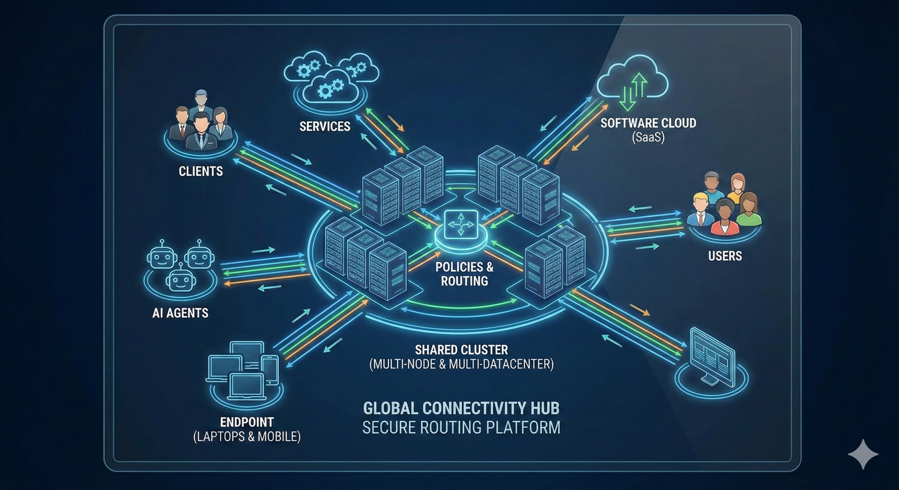

```
              🛷 TOBOGGANING - Slide Into Zero Trust Security! 🛷
                         
                              ⛄ "Downhill to Security!" ⛄
                                      
                        ╭─────────────────────────────────╮
                       ╱                                   ╲
                      ╱    ◉     T O B O G G A N I N G     ◉    ╲
                     ╱                                           ╲
                    ╱         🛡️ Zero Trust Architecture         ╲
                   ╱                                               ╲
                  ╱─────────────────────────────────────────────────╲
                 ╱███████████████████████████████████████████████████╲
                ╱░░░░░░░░░░░░░░░░░░░░░░░░░░░░░░░░░░░░░░░░░░░░░░░░░░░░░░░╲
               ╱▓▓▓▓▓▓▓▓▓▓▓▓▓▓▓▓▓▓▓▓▓▓▓▓▓▓▓▓▓▓▓▓▓▓▓▓▓▓▓▓▓▓▓▓▓▓▓▓▓▓▓▓▓▓▓╲
              ╱════════════════════════════════════════════════════════╲
             ╱      ❄️ WireGuard VPN  •  🔒 Enterprise Security        ╲  
            ╱           💻 Multi-Platform  •  📱 Mobile Apps            ╲
           ╱                                                             ╲
          ╱_______________________________________________________________╲
              ╲╲╲╲╲╲╲╲╲╲╲  Sliding down the security slope!  ╱╱╱╱╱╱╱╱╱╱╱
                  
    ╭───────────────────────────────────────────────────────────────────────╮
    │  🛡️ SECURE  •  🚀 LIGHTNING FAST  •  🔓 OPEN SOURCE  •  🛷 POWERED  │
    ╰───────────────────────────────────────────────────────────────────────╯
```

# Tobogganing

[](https://github.com/penguintechinc/Tobogganing/releases)
[](https://github.com/penguintechinc/Tobogganing/actions)
[](https://opensource.org/licenses/MIT)
[](https://goreportcard.com/report/github.com/penguintechinc/Tobogganing)

**Tobogganing** is an Open Source Secure Access Service Edge (SASE) solution implementing Zero Trust Network Architecture (ZTNA) principles. Built with modern technologies like WireGuard, Go, and Python, it provides enterprise-grade network security with the flexibility of open source.

🌐 **Website**: [tobogganing.io](https://tobogganing.io)  
📚 **Documentation**: [docs.tobogganing.io](https://docs.tobogganing.io)

## 🚀 Features

### Zero Trust Security
- **Dual Authentication**: X.509 certificates + JWT/SSO integration
- **Never Trust, Always Verify**: Every connection authenticated and authorized
- **Certificate Management**: Automated certificate lifecycle management
- **Multi-Factor Authentication**: Support for various authentication methods
- **Unified Policy Engine**: Single policy schema enforced across WireGuard clients AND Kubernetes services via Cilium CRDs
- **gRPC Policy Streaming**: Sub-second policy push via Redis pub/sub fanout to all connected hub-routers
- **Real-time Access Testing**: Test access rules before deployment

### High Performance
- **WireGuard VPN**: Modern, fast, and secure VPN protocol
- **Concurrent Architecture**: Go-based headend with concurrent connection handling
- **Async Python**: Manager service built with Python asyncio for high throughput
- **Optimized Protocols**: Support for HTTP/HTTPS, TCP, and UDP traffic
- **Dynamic Port Configuration**: Admin-configurable proxy listening ports
- **PyDAL Database**: MySQL/PostgreSQL/SQLite with read replica support

### Enterprise Ready
- **Multi-Platform**: Native clients for Mac, Windows, and Linux with system tray integration
- **Cloud Native**: Kubernetes-ready with auto-scaling and monitoring
- **Kubernetes CNI**: High-performance Container Network Interface plugin for pod-level networking
- **Traffic Mirroring**: Suricata IDS/IPS integration (VXLAN/GRE/ERSPAN)
- **Compliance**: Syslog audit logging and compliance reporting
- **High Availability**: Multi-datacenter orchestration with failover
- **VRF + iBGP/OSPF Underlay**: Enterprise network segmentation with FRR, iBGP AS 65001 inter-site routing
- **Cilium WireGuard Encryption**: Node-to-node WireGuard encryption managed by Cilium CNI with L7 policy enforcement
- **Zeek Network Analysis**: Deep packet inspection alongside Suricata IDS/IPS via VXLAN mirror tap
- **Database Backup System**: Local and S3-compatible storage with encryption

### Advanced Management
- **Web Management Portal**: Beautiful py4web interface with role-based access (Admin/Reporter)
- **Real-time Analytics**: Operating system distribution, traffic monitoring, and performance metrics
- **Interactive Dashboards**: Chart.js visualizations with hourly/daily aggregations
- **Comprehensive API**: RESTful API with OpenAPI documentation
- **Prometheus Metrics**: Built-in metrics with authenticated endpoints
- **Health Monitoring**: Kubernetes-compatible health checks (/health, /healthz)

### Easy Deployment
- **Multi-Architecture Support**: ARM64 and AMD64 Docker images
- **Cross-Platform Binaries**: Native builds for all major platforms including embedded devices
- **Automated CI/CD**: Complete GitHub Actions workflows for building, testing, and releasing
- **Infrastructure as Code**: Terraform, Kubernetes, and Docker Compose configurations
- **Next.js Marketing Website**: Cloudflare Pages deployment with Workers

## 🏗️ Architecture



Tobogganing implements a comprehensive SASE architecture with three main components:

```
┌─────────────────────────────────────────────────────────────────────────┐
│                        TOBOGGANING SASE ARCHITECTURE                     │
├─────────────────────────────────────────────────────────────────────────┤
│                                                                          │
│   ┌──────────────┐        ┌──────────────┐        ┌──────────────┐    │
│   │   CLIENTS    │        │   HEADEND    │        │   MANAGER    │    │
│   │              │        │   SERVER     │        │   SERVICE    │    │
│   │ • Native GUI │◄──────►│ • WireGuard  │◄──────►│ • Web Portal │    │
│   │ • Docker     │        │ • Go Proxy   │        │ • REST API   │    │
│   │ • Mobile     │        │ • PolicyEng. │        │ • PyDAL DB   │    │
│   │ • Embedded   │        │ • IDS/IPS    │        │ • Metrics    │    │
│   └──────────────┘        └──────────────┘        └──────────────┘    │
│         ▲                        ▲                        ▲            │
│         │                        │                        │            │
│   ┌─────▼──────────────────────▼────────────────────────▼─────┐      │
│   │               SUPPORTING INFRASTRUCTURE                     │      │
│   │  • Redis Cache  • MySQL/PostgreSQL  • Prometheus/Grafana   │      │
│   │  • Suricata IDS • Zeek Analysis    • Syslog Server        │      │
│   └─────────────────────────────────────────────────────────┘      │
└─────────────────────────────────────────────────────────────────────────┘
```

### Manager Service (Python 3.13)
- **Web Management Portal**: py4web-based interface with role-based access control
- **Certificate Authority**: Automated X.509 certificate generation and lifecycle management
- **Database Backend**: PyDAL with MySQL/PostgreSQL/SQLite and read replica support
- **API Gateway**: RESTful API for client registration and configuration distribution
- **Analytics Engine**: Real-time metrics collection and aggregation
- **Backup System**: Local and S3-compatible storage with encryption

### Headend Server (Go 1.24)
- **WireGuard VPN**: High-performance VPN termination with peer-to-peer routing
- **Multi-Protocol Proxy**: TCP/UDP/HTTP/HTTPS with configurable listening ports
- **Traffic Security**: Unified policy engine — 6-dimension rule matching (domains, ports, CIDRs, users, groups, protocols)
- **IDS/IPS Integration**: Traffic mirroring to Suricata via VXLAN/GRE/ERSPAN
- **Authentication**: JWT validation and external IdP integration (SAML2/OAuth2)
- **Network Routing**: VRF and OSPF support through FRR integration

### Client Applications
- **Native Desktop**: Go-based clients for Windows, macOS, and Linux with system tray
- **Docker Container**: Containerized client for Kubernetes and Docker deployments
- **Mobile Apps**: React Native applications for iOS and Android
- **Embedded Support**: Lightweight clients for ARM, MIPS, and IoT devices
- **Auto-Configuration**: Automatic certificate rotation and configuration updates

## 🚀 Quick Start

### Using Docker Compose (Recommended for Testing)

1. **Clone the repository**:
   ```bash
   git clone https://github.com/penguintechinc/tobogganing.git
   cd tobogganing/deploy/docker-compose
   ```

2. **Configure environment**:
   ```bash
   cp .env.example .env
   # Edit .env with your configuration
   ```

3. **Start services**:
   ```bash
   docker-compose -f docker-compose.dev.yml up -d
   ```

4. **Access the interface**:
   - Manager Web UI: http://localhost:8000
   - API Documentation: http://localhost:8000/api/docs

### Native Client Installation

Tobogganing provides two types of client applications optimized for different use cases:

#### 🖼️ **Desktop GUI Clients** (Recommended for End Users)
**Full system tray integration with one-click connect/disconnect**

```bash
# Quick install with GUI support
curl -sSL https://github.com/penguintechinc/tobogganing/releases/latest/download/install-gui.sh | bash

# Manual download
# macOS (Universal - Intel + Apple Silicon)
curl -L https://github.com/penguintechinc/tobogganing/releases/latest/download/tobogganing-client-darwin-universal -o tobogganing-client

# Linux (AMD64)
curl -L https://github.com/penguintechinc/tobogganing/releases/latest/download/tobogganing-client-linux-amd64 -o tobogganing-client

# Windows (AMD64)
curl -L https://github.com/penguintechinc/tobogganing/releases/latest/download/tobogganing-client-windows-amd64.exe -o tobogganing-client.exe
```

**GUI Features:**
- ✅ System tray icon with real-time status
- ✅ Connect/disconnect with single click  
- ✅ Connection statistics and monitoring
- ✅ Automatic configuration updates
- ✅ Settings and about dialogs
- ✅ Cross-platform native experience

#### 🖥️ **Headless Clients** (For Servers & Automation)
**CLI-only for Docker containers, servers, and embedded systems**

```bash
# Quick install headless version
curl -sSL https://github.com/penguintechinc/tobogganing/releases/latest/download/install-headless.sh | bash

# Manual download - add "-headless" to any platform name
curl -L https://github.com/penguintechinc/tobogganing/releases/latest/download/tobogganing-client-linux-amd64-headless -o tobogganing-client
```

**Headless Features:**
- ✅ Command-line interface only
- ✅ Perfect for automation and scripts
- ✅ Docker container friendly
- ✅ Embedded system support (ARM, MIPS)
- ✅ Smaller binary size
- ✅ No GUI dependencies

#### Configuration & Usage

```bash
# Initialize client (both GUI and headless)
./tobogganing-client init --manager-url https://manager.example.com:8000 --api-key YOUR_API_KEY

# GUI Mode - Start with system tray
./tobogganing-client gui

# Headless Mode - Connect as daemon
./tobogganing-client connect --daemon

# Check connection status
./tobogganing-client status
```

## 📖 Documentation

- **[Installation Guide](https://docs.tobogganing.io/installation)** - Get up and running quickly
- **[Architecture Guide](https://docs.tobogganing.io/architecture)** - Understand the system design
- **[Deployment Guide](https://docs.tobogganing.io/deployment)** - Production deployment instructions
- **[API Reference](https://docs.tobogganing.io/api)** - Complete API documentation
- **[Use Cases](https://docs.tobogganing.io/use-cases)** - Real-world examples and configurations

## 🛠️ Development

### Prerequisites
- Go 1.24+ (for headend and client)
- Python 3.13+ (for manager)
- Node.js 18+ (for website)
- Docker (for containerized development)

### Building from Source

```bash
# Clone repository
git clone https://github.com/penguintechinc/tobogganing.git
cd tobogganing

# Quick build all React applications + screenshots
./scripts/build-apps.sh

# Alternative: Build individual components
./scripts/build-apps.sh --mobile-only      # Mobile app only
./scripts/build-apps.sh --website-only     # Website only  
./scripts/build-apps.sh --screenshots-only # Screenshots only

# Build Manager Service
cd manager
pip install -r requirements.txt
python -m manager.main

# Build Headend Server
cd headend
go build -o build/headend ./cmd

# Build Native Client
cd clients/native
make all  # Builds for all platforms
# or
make local  # Build for current platform only
```

### Running Tests

```bash
# Python tests
cd manager && pytest

# Go tests (headend)
cd headend && go test ./...

# Go tests (client)
cd clients/native && go test ./...

# Integration tests
make test-integration
```

### Build Artifacts

The build process generates the following artifacts:

```bash
build/
├── apps/
│   ├── mobile-android.bundle      # React Native Android bundle
│   ├── mobile-ios.bundle         # React Native iOS bundle  
│   ├── mobile-assets/            # Mobile app assets
│   ├── website-static/           # Next.js static files
│   └── website-export/           # Exported website
├── screenshots/                  # Generated app screenshots
└── BUILD_REPORT.md              # Comprehensive build report

website/public/images/screenshots/  # Website screenshots
├── homepage-desktop.png
├── features-desktop.png
├── mobile-connection-screen.png
└── ...more screenshots
```

## 🚢 Deployment Options

### Kubernetes (Production)
```bash
cd deploy/kubernetes
kubectl apply -f .
```

### Terraform (Cloud)
```bash
cd deploy/terraform
terraform init
terraform plan
terraform apply
```

### Docker Compose (Development)
```bash
cd deploy/docker-compose
docker-compose up -d
```

See the [Deployment Guide](deploy/README.md) for detailed instructions.

## 🤝 Contributing

We welcome contributions! Please read our [Contributing Guide](CONTRIBUTING.md) for details on:

- Code of conduct
- Development setup
- Pull request process
- Coding standards
- Testing requirements

## 🛡️ Security

Security is our top priority. We follow responsible disclosure practices:

- Report security issues to: security@penguintech.io
- See our [Security Policy](SECURITY.md) for details
- Regular security audits and updates

## 📄 License

**License Highlights:**
- **Personal & Internal Use**: Free under AGPL-3.0
- **Commercial Use**: Requires commercial license
- **SaaS Deployment**: Requires commercial license if providing as a service

### Contributor Employer Exception (GPL-2.0 Grant)

Companies employing official contributors receive GPL-2.0 access to community features:

- **Perpetual for Contributed Versions**: GPL-2.0 rights to versions where the employee contributed remain valid permanently, even after the employee leaves the company
- **Attribution Required**: Employee must be credited in CONTRIBUTORS, AUTHORS, commit history, or release notes
- **Future Versions**: New versions released after employment ends require standard licensing
- **Community Only**: Enterprise features still require a commercial license

This exception rewards contributors by providing lasting fair use rights to their employers.

See [LICENSE.md](docs/LICENSE.md) for complete licensing details.

## 🙋 Support

### Community Support
- **GitHub Issues**: Bug reports and feature requests
- **Discussions**: Questions and community help
- **Discord**: Real-time chat and support
- **Documentation**: Comprehensive guides and tutorials

---

## 🆕 What's New in v0.1.0 — Unified Networking Layer

This release unifies three previously disconnected policy systems into a single, coherent control plane:

| Before | After |
|--------|-------|
| `policy_rules`, `firewall_rules`, `access_control_manager` — 3 separate systems | One canonical `policy_rules` schema with `scope`, `direction`, and JSON array fields |
| Go PolicyEngine dead code | PolicyEngine wired into all 5 proxy check sites |
| Standard K8s NetworkPolicy | Cilium `CiliumNetworkPolicy` CRDs with L7 FQDN matching |
| Suricata-only IDS | Zeek + Suricata dual IDS via VXLAN mirror tap |
| REST polling (with envelope bug) | gRPC streaming + Redis pub/sub fanout |
| OSPF-only routing | FRR iBGP AS 65001 + OSPF underlay for inter-site VRF exchange |

**Key components shipped:**
- `services/hub-api/database/__init__.py` — unified `policy_rules` table
- `services/hub-api/api/routes.py` — CRUD + Redis pub/sub triggers
- `services/hub-api/grpc/server.py` — gRPC policy streaming server (port 50051)
- `services/hub-api/network/cilium_translator.py` — `policy_rules` → `CiliumNetworkPolicy` CRD translator
- `services/hub-api/network/k8s_client.py` — Kubernetes CRD apply/delete client
- `services/hub-router/internal/policy/engine.go` — enhanced 6-dimension policy engine
- `services/hub-router/proxy/policy_adapter.go` — API → engine policy conversion
- `services/hub-router/proxy/main.go` — PolicyEngine wired at all 5 firewall check sites
- `services/hub-router/proxy/mirror/manager.go` — Zeek VXLAN mirror support
- `deploy/frr/` — FRR iBGP + OSPF config for us-east and eu-west
- `deploy/zeek/` — Zeek site scripts for WireGuard + TLS analysis
- `k8s/helm/tobogganing/values-cilium.yaml` — Cilium WireGuard encryption overlay

---

**Made with ❤️ by the open source community**

*Tobogganing - Secure Access, Simplified*
