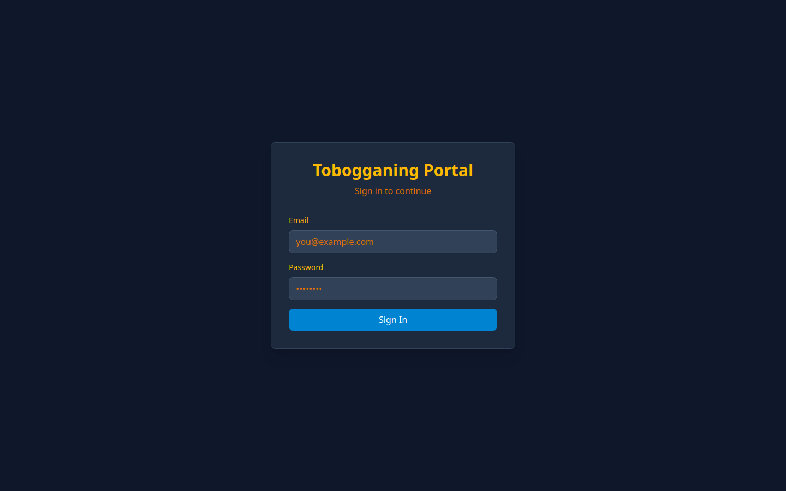
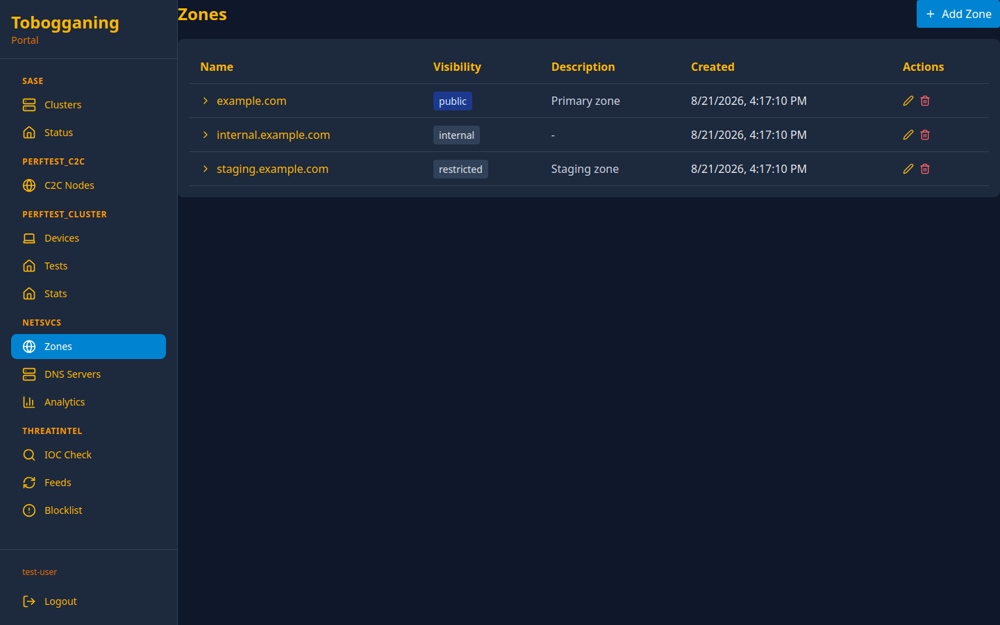
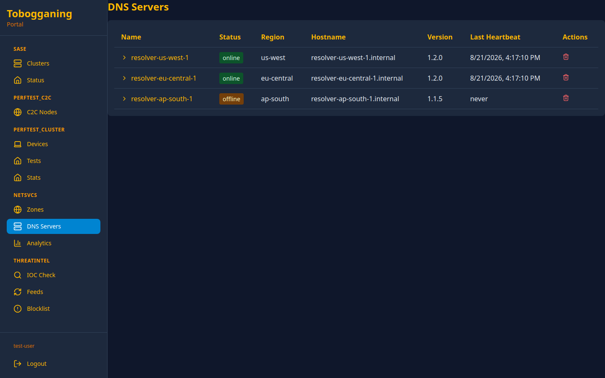
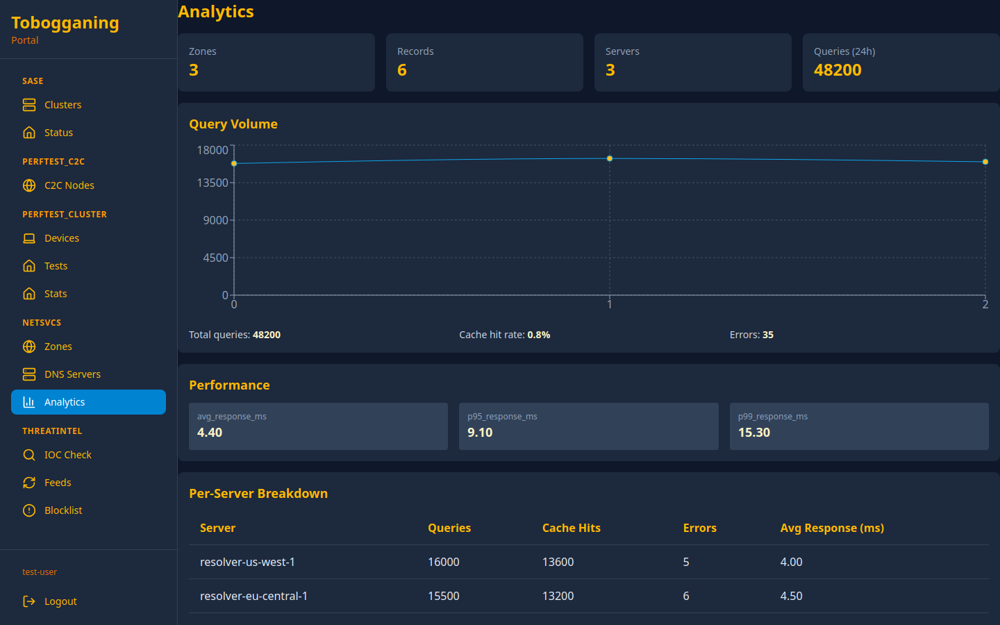
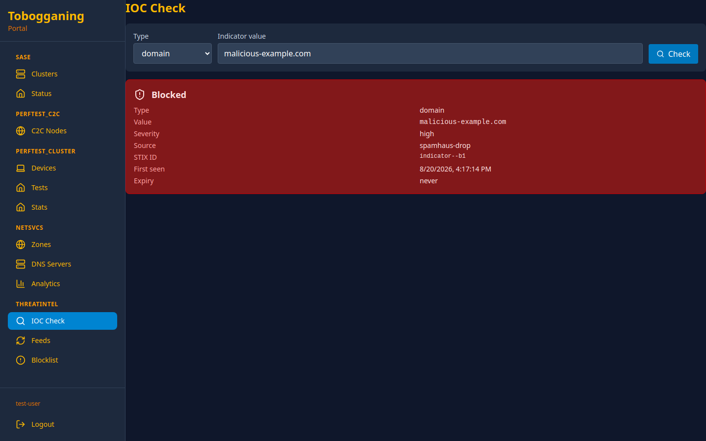
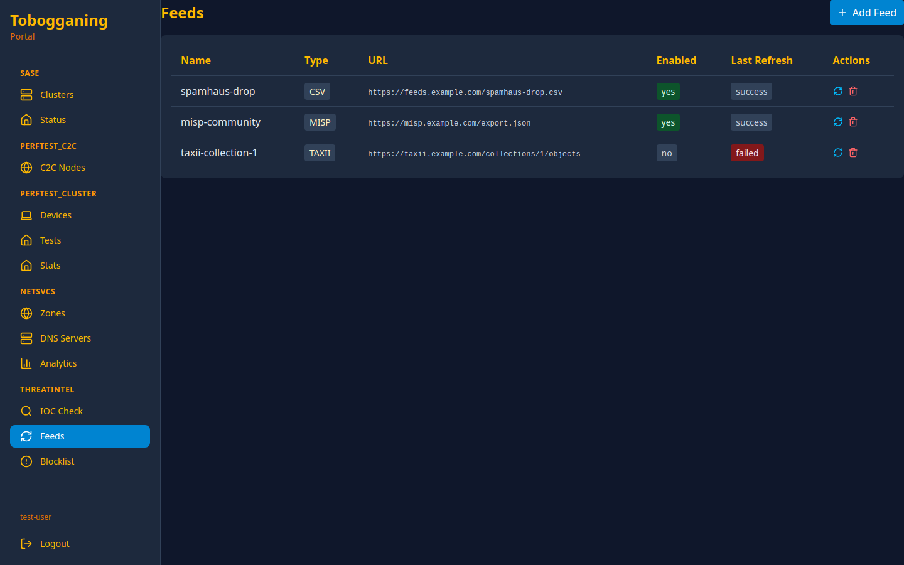
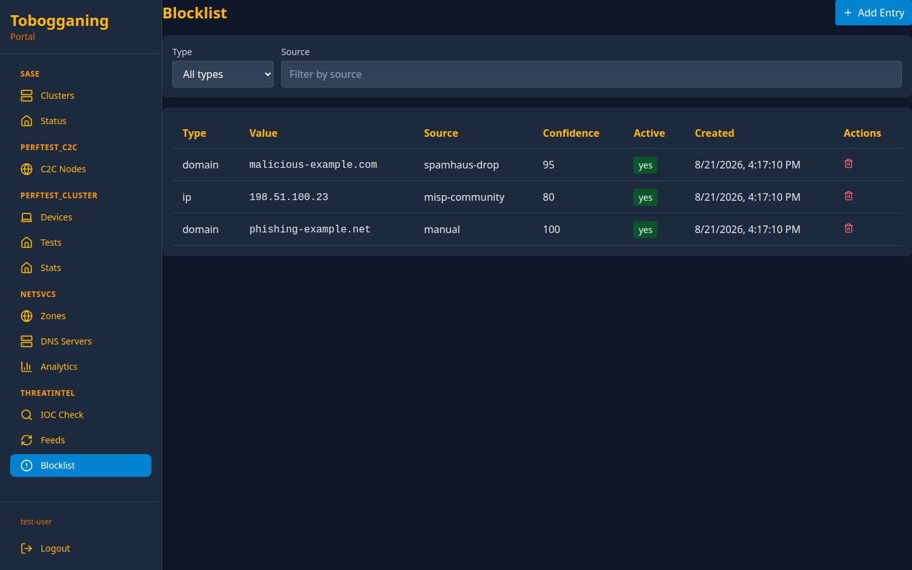

```
              🛷 TOBOGGANING — Slide Into Zero Trust! 🛷
                     ⛄ "Downhill to Security!" ⛄

                ╭─────────────────────────────────╮
               ╱   ◉   T O B O G G A N I N G   ◉   ╲
              ╱      🛡️  Zero Trust · SASE Edge      ╲
             ╱───────────────────────────────────────╲
            ╱█████████████████████████████████████████╲
           ╱░░░░░░░░░░░░░░░░░░░░░░░░░░░░░░░░░░░░░░░░░░░░░╲
          ╱  ❄️ WireGuard · DoH/DoT · Threat-Intel · mTLS ╲
         ╱______________________________________________╲
             ╲╲╲╲╲  Sliding down the security slope!  ╱╱╱╱╱
```

# Tobogganing

[](https://github.com/penguintechinc/tobogganing/releases)
[](https://github.com/penguintechinc/tobogganing/actions)
[](LICENSE)

**Tobogganing is an open-source SASE (Secure Access Service Edge) + Zero-Trust Network Access (ZTNA) platform.** It fuses identity-aware connectivity, DNS-layer security, and threat intelligence into a single, policy-driven secure service edge — enforcing least-privilege, micro-segmented access across **intra-cluster, inter-cluster, and external-cluster** boundaries.

Every request is authenticated, every peer is verified, every zone is scoped: *never trust, always verify.*

---

## 🧭 The Three Pillars — SCP

Tobogganing is organized around **Security, Connectivity, and Policies (SCP)**, each applied consistently across the three connectivity domains.

| Pillar | What it delivers | Key building blocks |
|--------|------------------|---------------------|
| 🛡️ **Security** | Zero-trust identity + DNS-layer threat defense | Threat-intel IOC feeds, blocklist curation, DNS filtering; OIDC scopes; machine-JWT node enrollment; per-tenant isolation; mTLS/SPIFFE-ready |
| 🔌 **Connectivity** | Identity-aware secure edge across every boundary | Unified Rust **node-agent** (WireGuard + local DNS/DHCP/NTP edge), **netsvcs** DNS control plane with DoH/DoT resolvers, SD-WAN |
| 📜 **Policies** | Centralized, tenant-scoped policy enforcement | SASE Secure Web Gateway rules, DNS zones / records / split-horizon, SD-WAN routing policy, least-privilege access rules |

### Applied across three connectivity domains

| Domain | Boundary | Transport |
|--------|----------|-----------|
| **Intra-cluster** | Service ⇄ service inside one cluster | gRPC (`ManagerService`, port `50051`) |
| **Inter-cluster** | Cluster ⇄ cluster (multi-datacenter / SD-WAN) | WireGuard tunnels + gRPC/REST |
| **External-cluster** | Edge / bare-metal clients ⇄ the hub | REST `/api/v1` (HTTP/2) + WireGuard |

---

## 🏗️ Architecture

A central **control plane** (`hub-api`) is the brain: it holds identity, policy, DNS config, and threat-intel state, and hands them out over **gRPC inside the cluster** and **REST to external edges**. Data-plane components — the DoH/DoT resolver fleet, the WireGuard router, and the Rust node-agents — enroll with machine JWTs and pull live config.

```
                        ┌──────────────────────────────────┐
                        │   portal  (hub-webui)            │
                        │   React + TypeScript · Vite       │
                        └──────────────────┬───────────────┘
                                           │ REST /api/v1 (OpenAPI 3.x)
                                           ▼
   ┌───────────────────┐   gRPC :50051  ┌──────────────────────────────────┐
   │  netsvcs-dns      │  ManagerService│   hub-api   (CONTROL PLANE)      │
   │  DoH :8080 / HTTP2│◀──────────────▶│   Quart · modular registry        │
   │  DoT :853         │  GetConfig      │   netsvcs · threatintel · sase ·  │
   │  split-horizon    │  StreamConfig   │   sdwan · perftest · ziti · ping  │
   │  + IOC filtering  │  CheckIOC       │   REST :8080  ·  gRPC :50051      │
   │  (DaemonSet)      │                 └───────┬──────────────────┬───────┘
   └─────────▲─────────┘                gRPC :50051│         WireGuard /       │
             │ :53 forward              (intra)    │         policy config     │
             │                                     ▼                           │
   ┌─────────┴───────────────┐          ┌────────────────────────────┐        │
   │  node-agent  (Rust)     │◀────────▶│  hub-router  (DATA PLANE)  │        │
   │  connectivity: WG/Ziti  │ WireGuard│  WireGuard :51820          │        │
   │  netsvcs-edge: :53 DNS  │  tunnel  │  proxy :8443 · IDS/IPS      │        │
   │  DHCP · NTP             │          │  mirror · metrics :9090     │        │
   │  DaemonSet + musl binary│          └────────────────────────────┘        │
   └─────────┬───────────────┘                                                │
             │ REST /api/v1  —  external / bare-metal / inter-cluster edges ───┘
             ▼
      external clusters & edge sites
```

**Transport boundary:** gRPC is the intra-cluster contract (`hub-api` ⇄ `netsvcs-dns`, `hub-api` ⇄ `node-agent` DaemonSets); REST `/api/v1` serves external clients (edge/bare-metal node-agents, the portal, inter-cluster peers). The Rust node-agent's `transport` crate selects gRPC (tonic) or REST (reqwest) at runtime from `AgentConfig::mode`.

---

## 🧩 Components & Modules

### Deployable services

| Service | Stack | Role | Ports |
|---------|-------|------|-------|
| **hub-api** | Python 3.13 · Quart · gRPC | Control-plane brain — auth, policy, DNS config, threat-intel, module registry | REST `8080`, gRPC `50051` |
| **hub-router** | WireGuard data plane | Tunnel termination + multi-protocol proxy + IDS/IPS traffic mirror | WG `51820`, proxy `8443`, metrics `9090` |
| **hub-webui** (`portal/`) | React · TypeScript · Vite · Express | Management web UI (see [New in this release](#-new-in-this-release)) | `3000` |
| **netsvcs-dns** (`engines/netsvcs-dns/`) | Python DaemonSet | DoH/DoT resolver — split-horizon + IOC filtering, Redis-cached | DoH `8080`, DoT `853`, metrics `9090` |
| **node-agent** (`agents/node-agent/`) | Rust (aya · tonic · reqwest) | Unified edge client — WireGuard/Ziti connectivity + local DNS/DHCP/NTP edge | local DNS `53` |
| **redis / valkey** | StatefulSet | Config + resolver response cache | `6379` |

### `hub-api` modules (`hub_api/modules/`)

| Module | Responsibility |
|--------|----------------|
| **netsvcs** | DNS control plane — zone/record/server managers, analytics, gRPC `ManagerService`, IOC check |
| **threatintel** | IOC feed ingestion (STIX/TAXII + custom parsers), URL safety, blocklist curation & store |
| **sase** | Secure Web Gateway policy, block-page/routing, out-of-band analysis-tool adapters |
| **sdwan** | SD-WAN orchestration, certs, firewall, network segmentation |
| **perftest_cluster / _client / _c2c** | Cluster, client, and cluster-to-cluster performance testing (WaddlePerf lineage) |
| **ziti** | OpenZiti overlay integration |
| **ping** | Lightweight reachability / health probes |

### The unified Rust node-agent (`agents/node-agent/crates/`)

One static binary, two jobs — SASE connectivity **and** local netsvcs edge — packaged both as a musl bare-metal build and a K8s DaemonSet container.

| Crate | Role |
|-------|------|
| `agent` | Binary entrypoint — wires connectivity + edge into one process |
| `connectivity` | WireGuard/Ziti data plane, XDP inspection tap |
| `netsvcs-edge` | Local `:53` DNS + DHCP + NTP, forwarding DNS to the DoH resolver fleet |
| `transport` | gRPC (tonic) + REST (reqwest) `ControlPlaneClient`, selected at runtime |
| `core` | Shared config, errors, machine-JWT signing, control-plane contract |

### gRPC control-plane contract (`proto/netsvcs/v1/manager.proto`)

`package netsvcs.manager.v1` — `ManagerService`: `RegisterServer`, `RefreshToken`, `GetConfig`, `StreamConfigUpdates`, `SendHeartbeat`, `ValidateToken`, `CheckIOC`. Nodes enroll with a machine JWT and stream live config updates.

---

## ✨ New in This Release

### 🖥️ netsvcs + threat-intel Web UI

A full management surface for DNS and threat intelligence, served from `portal/`:

- **netsvcs / DNS** — [`ZonesPage`](portal/src/pages/netsvcs/ZonesPage.tsx) (zones + split-horizon), [`ZoneRecordsPage`](portal/src/pages/netsvcs/ZoneRecordsPage.tsx) (records), [`DnsServersPage`](portal/src/pages/netsvcs/DnsServersPage.tsx) (resolver fleet health), [`AnalyticsPage`](portal/src/pages/netsvcs/AnalyticsPage.tsx) (query analytics)
- **threat-intel** — [`IocCheckPage`](portal/src/pages/threatintel/IocCheckPage.tsx) (on-demand IOC lookup), [`FeedsPage`](portal/src/pages/threatintel/FeedsPage.tsx) (feed source management), [`BlocklistPage`](portal/src/pages/threatintel/BlocklistPage.tsx) (blocklist curation)

### 🦀 Unified Rust node-agent

WireGuard connectivity and the local DNS/DHCP/NTP edge collapse into **one** memory-safe Rust binary — a single install per node instead of a stack of daemons, with runtime gRPC/REST transport selection.

### 📦 One Helm umbrella

The whole SASE + netsvcs stack now deploys as a single Helm release — `hub-api`, `hub-router`, `hub-webui`, the `netsvcs-dns` resolver fleet, and the `node-agent` DaemonSet, with optional out-of-band analysis tools (Suricata, Zeek, Arkime, Strelka, CAPE) off by default.

---

## 🖼️ Screenshots

> Captured against seeded mock data. See [`docs/screenshots/`](docs/screenshots/).

**Authentication**



**netsvcs — DNS control plane**

| Zones | Servers | Analytics |
|-------|---------|-----------|
|  |  |  |

**Threat intelligence**

| IOC Check | Feeds | Blocklist |
|-----------|-------|-----------|
|  |  |  |

---

## 🚀 Deployment

Tobogganing ships as a single Helm umbrella chart: [`k8s/helm/tobogganing`](k8s/helm/tobogganing). The environment lives in the kube-context and the values file — never in the namespace (always `tobogganing`).

### Alpha — local MicroK8s

```bash
helm dependency build k8s/helm/tobogganing
helm upgrade --install tobogganing k8s/helm/tobogganing \
  --kube-context local-alpha \
  --namespace tobogganing --create-namespace \
  --values k8s/helm/tobogganing/values-alpha.yaml
```

### Beta → Gamma → Production

CI builds and publishes images to `ghcr.io/penguintechinc/tobogganing/{service}`; deploy with the matching values file and context.

| Env | Context | Values file |
|-----|---------|-------------|
| Alpha | `local-alpha` | `values-alpha.yaml` |
| Beta | `dal2-beta` | `values-beta.yaml` |
| Gamma | `dal2-gamma` | `values-gamma.yaml` |
| Production | `tobogganing-prod` | `values-production.yaml` |

```bash
helm upgrade --install tobogganing k8s/helm/tobogganing \
  --kube-context dal2-beta \
  --namespace tobogganing \
  --values k8s/helm/tobogganing/values-beta.yaml
```

Optional analysis-tool sub-charts (`suricata`, `zeek`, `arkime`, `strelka`, `cape`) are off by default — enable per [`k8s/helm/tobogganing/OPTIONAL_SUBCHARTS.md`](k8s/helm/tobogganing/OPTIONAL_SUBCHARTS.md).

---

## 🛠️ Development

**Prerequisites:** Python 3.13+, Rust 1.98+, Node.js 20+, Docker, and a local Kubernetes (MicroK8s / Docker Desktop).

```bash
# Control plane (hub-api) — Quart + gRPC
cd hub_api && pip install -r requirements.txt && python -m hub_api.app

# DoH/DoT resolver
cd engines/netsvcs-dns && pip install -r requirements.txt && python -m app.main

# Unified node-agent
cd agents/node-agent && cargo build --release

# Web UI
cd portal && npm ci && npm run dev
```

### Tests

```bash
make test              # full suite
pytest hub_api/tests                              # control-plane
cd engines/netsvcs-dns && pytest --cov --cov-fail-under=90   # resolver (90%+ gate)
cd agents/node-agent && cargo test                # node-agent
cd portal && npm test                             # web UI
```

The REST API publishes an OpenAPI 3.x spec at [`openapi/v1.yaml`](openapi/v1.yaml).

---

## 📖 Documentation

| Guide | Path |
|-------|------|
| Overview | [`docs/OVERVIEW.md`](docs/OVERVIEW.md) |
| Architecture | [`docs/ARCHITECTURE.md`](docs/ARCHITECTURE.md) |
| Quickstart | [`docs/QUICKSTART.md`](docs/QUICKSTART.md) |
| Authentication | [`docs/AUTHENTICATION.md`](docs/AUTHENTICATION.md) |
| API reference | [`docs/API.md`](docs/API.md) |
| Client installation | [`docs/CLIENT_INSTALLATION.md`](docs/CLIENT_INSTALLATION.md) |
| netsvcs-dns resolver | [`engines/netsvcs-dns/README.md`](engines/netsvcs-dns/README.md) |

---

## 🤝 Contributing & Security

- Contributions: see [`docs/CONTRIBUTING.md`](docs/CONTRIBUTING.md)
- Report vulnerabilities responsibly: see [`SECURITY.md`](SECURITY.md)

## 📄 License

Licensed under **AGPL-3.0** for personal and internal use; commercial and SaaS deployments require a commercial license, and enterprise features are separately licensed. See [`LICENSE`](LICENSE) and [`docs/LICENSE.md`](docs/LICENSE.md) for the full terms, including the Contributor Employer (GPL-2.0) exception.

---

*Made with ❄️ by PenguinTech — secure access, simplified.*
