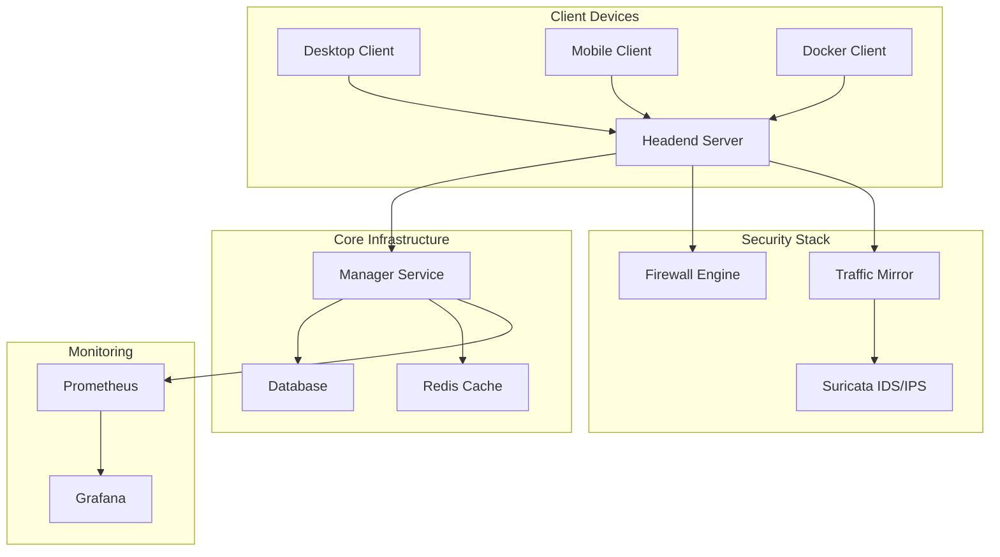

# Welcome to Tobogganing Documentation


## 🛡️ Open Source Secure Access Service Edge (SASE)

Tobogganing is a comprehensive **Zero Trust Network Architecture (ZTNA)** solution that combines network security and connectivity into a single, powerful platform. Built on modern cloud-native principles, it provides enterprise-grade security for organizations of any size.

### 🚀 Quick Links

<div class="grid cards" markdown>

-   :material-rocket-launch-outline: **[Quick Start Guide](quickstart.md)**

    ---

    Get up and running with Tobogganing in minutes. Follow our step-by-step installation guide.

-   :material-download: **[Client Installation](client-installation.md)**

    ---

    Download and install clients for Windows, macOS, Linux, and mobile platforms.

-   :material-cog: **[Configuration Guide](tunnel-configuration.md)**

    ---

    Configure split tunneling, firewall rules, and advanced network settings.

-   :material-api: **[API Reference](api.md)**

    ---

    Complete REST API documentation for developers and system integrators.

</div>

## 🌟 Key Features

### 🔒 Zero Trust Security
- **Mutual TLS Authentication** - Certificate-based device and user authentication
- **JWT Token Management** - Secure token-based authorization
- **Advanced Firewall** - Domain, IP, protocol, and port-level access control
- **Traffic Mirroring** - Real-time IDS/IPS integration with Suricata

### 🌐 Network Architecture
- **WireGuard VPN** - Modern, high-performance VPN technology
- **Multi-Protocol Proxy** - HTTP, HTTPS, TCP, UDP traffic handling
- **VRF Segmentation** - Virtual routing and forwarding for network isolation
- **OSPF Routing** - Dynamic routing across WireGuard tunnels

### 📊 Management & Monitoring
- **Web Management Portal** - Beautiful admin interface with role-based access
- **Real-time Metrics** - Prometheus integration with Grafana dashboards
- **System Monitoring** - Client and headend health tracking
- **Audit Logging** - Comprehensive security and access logging

### 🏢 Enterprise Features
- **Multi-Datacenter** - Centralized orchestration across regions
- **High Availability** - Redundant headend deployments
- **Auto-Discovery** - Automatic client and headend registration
- **Certificate Management** - Automated certificate lifecycle management

## 📋 Architecture Overview



## 🏗️ System Components

| Component | Technology | Purpose |
|-----------|------------|---------|
| **Manager Service** | Python 3.12 + py4web | Centralized orchestration and certificate management |
| **Headend Server** | Go + WireGuard | VPN termination and traffic proxying |
| **Native Clients** | Go (Multi-platform) | Desktop and server clients with GUI/headless modes |
| **Docker Client** | Docker + WireGuard | Containerized client for easy deployment |
| **Web Portal** | py4web + Bootstrap | Management interface with role-based access |

## 🎯 Getting Started

### 1. Choose Your Deployment Method

=== "Docker Compose (Recommended)"

    Quick setup for development and small deployments:

    ```bash
    git clone https://github.com/penguintechinc/tobogganing
    cd tobogganing
    docker-compose up -d
    ```

=== "Kubernetes"

    Enterprise deployment with high availability:

    ```bash
    kubectl apply -f deploy/kubernetes/
    ```

=== "Manual Installation"

    Custom deployment for specific requirements:

    ```bash
    # Install Manager Service
    cd manager && docker build -t tobogganing-manager .
    
    # Install Headend Server
    cd headend && docker build -t tobogganing-headend .
    ```

### 2. Install Clients

Choose the appropriate client for your platform:

- **[Windows](client-installation.md#windows)** - Native GUI client with system tray
- **[macOS](client-installation.md#macos)** - Universal binary (Intel + Apple Silicon)
- **[Linux](client-installation.md#linux)** - Native client with desktop integration
- **[Mobile](mobile-development.md)** - React Native apps (iOS/Android)
- **[Docker](client-installation.md#docker)** - Containerized client for servers

### 3. Configure Your Network

Set up your network topology and security policies:

1. **[Create VRFs](architecture.md#vrf-configuration)** for network segmentation
2. **[Configure OSPF](architecture.md#ospf-routing)** for dynamic routing
3. **[Set up firewall rules](web-portal-implementation.md#firewall-management)** for access control
4. **[Enable monitoring](metrics-monitoring.md)** for observability

## 📚 Documentation Sections

### Getting Started
- [Overview](overview.md) - High-level system overview
- [Quick Start](quickstart.md) - Get running in 5 minutes
- [Client Installation](client-installation.md) - Platform-specific installation guides
- [Usage Guide](usage.md) - Day-to-day operations

### Architecture & Design
- [System Architecture](architecture.md) - Detailed technical architecture
- [Authentication](authentication.md) - Security and authentication model
- [Features](features.md) - Complete feature list and capabilities

### Administration
- [Web Portal](web-portal-implementation.md) - Administrative interface guide
- [Metrics & Monitoring](metrics-monitoring.md) - Observability and alerting
- [Tunnel Configuration](tunnel-configuration.md) - Advanced networking options

### Development
- [Contributing](contributing.md) - How to contribute to the project
- [Mobile Development](mobile-development.md) - Mobile app development
- [API Reference](api.md) - REST API documentation
- [Release Notes](release-notes.md) - Version history and changes

### Legal & Licensing
- [Licensing](licensing.md) - Open source and commercial licensing
- [Multi-Product Licensing](multi-product-licensing.md) - Enterprise licensing options
- [License](license.md) - Full license text

## 🤝 Community & Support

### Get Involved
- **[GitHub Repository](https://github.com/penguintechinc/tobogganing)** - Source code and issues
- **[Contributing Guide](contributing.md)** - How to contribute
- **[Release Notes](release-notes.md)** - Latest updates and features

### Commercial Support
- **[Penguin Technologies](https://penguintech.io)** - Professional services and enterprise support
- **[Licensing Options](multi-product-licensing.md)** - Commercial and enterprise licensing

---

!!! tip "New to SASE and Zero Trust?"
    Check out our [Architecture Guide](architecture.md) to understand the core concepts and benefits of Zero Trust Network Architecture.

!!! info "Looking for Enterprise Features?"
    Explore our [Multi-Product Licensing](multi-product-licensing.md) options for advanced features like SSO, LDAP integration, and professional support.