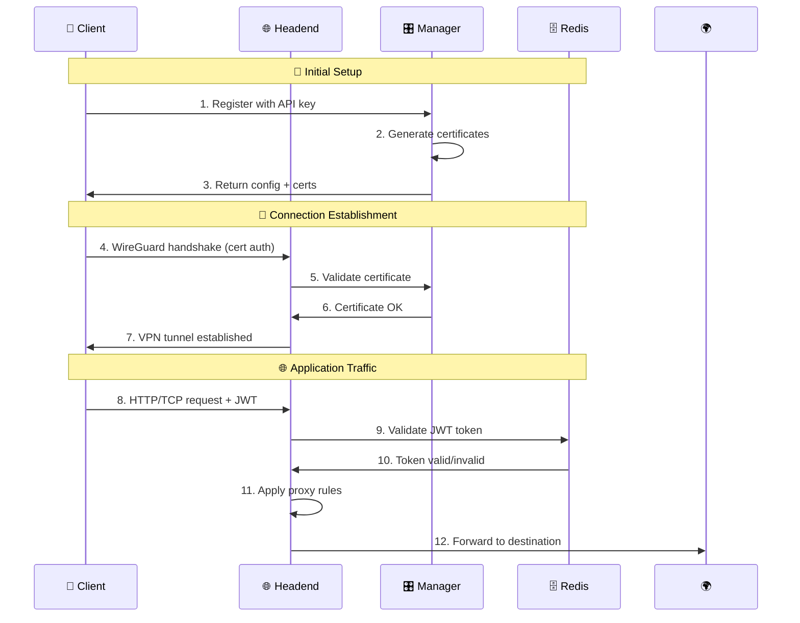
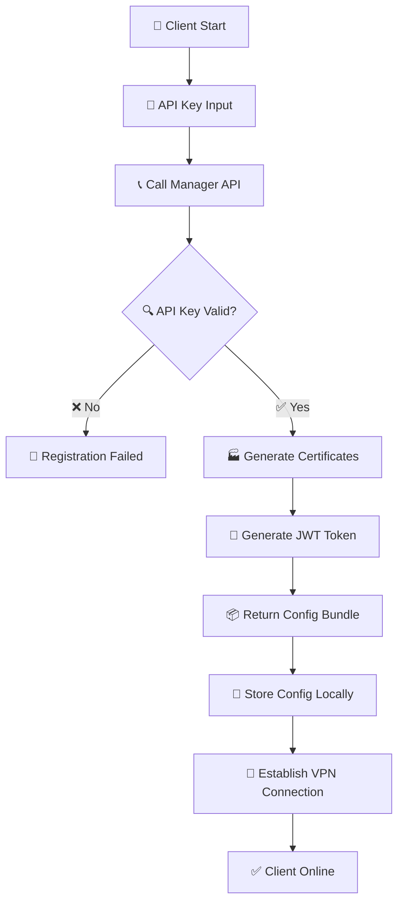
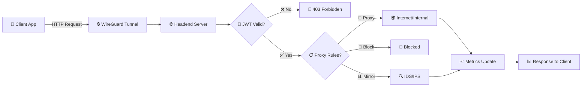

# 🏗️ SASEWaddle Architecture Guide

> **💡 Overview**: SASEWaddle implements a modern three-tier Zero Trust Network Architecture designed for enterprise-scale secure access.

## 📋 Table of Contents

- [🎯 Design Principles](#-design-principles)
- [🏛️ Architecture Overview](#️-architecture-overview)
- [🔧 Component Details](#-component-details)
- [🔒 Security Architecture](#-security-architecture)
- [📊 Data Flow](#-data-flow)
- [🚀 Deployment Patterns](#-deployment-patterns)
- [📈 Scalability](#-scalability)

---

## 🎯 Design Principles

### 🛡️ Zero Trust Foundation
```
┌─────────────────────────────────────────────────────────┐
│  🚫 NEVER TRUST           ✅ ALWAYS VERIFY             │
│                                                         │
│  • No implicit trust      • Authenticate every request │
│  • Assume breach          • Verify device & user       │
│  • Minimize access        • Continuous monitoring      │
└─────────────────────────────────────────────────────────┘
```

### 🔄 Core Principles

| Principle | Description | Implementation |
|-----------|-------------|----------------|
| 🔐 **Defense in Depth** | Multiple security layers | Certificate + JWT + TLS |
| 🎯 **Least Privilege** | Minimum required access | Role-based permissions |
| 📊 **Continuous Monitoring** | Real-time visibility | Audit logs + metrics |
| 🔄 **Zero Trust** | Verify everything | Dual authentication |

---

## 🏛️ Architecture Overview

### 🌐 High-Level Architecture

```
                    ┌─────────────────────────────────────────┐
                    │             🌍 Internet                 │
                    └─────────────────┬───────────────────────┘
                                      │
                    ┌─────────────────┴───────────────────────┐
                    │          🔄 Load Balancer               │
                    │      (ALB for API, NLB for VPN)        │
                    └─────────────────┬───────────────────────┘
                                      │
        ┌─────────────────────────────┼─────────────────────────────┐
        │                             │                             │
        ▼                             ▼                             ▼
┌───────────────┐           ┌─────────────────┐           ┌─────────────────┐
│  👤 Clients   │ ◄────────►│  🌐 Headend     │ ◄────────►│  🎛️ Manager     │
│               │           │    Server       │           │   Service       │
│ 🖥️ Native App │           │                 │           │                 │
│ 🐳 Docker     │           │ • WireGuard     │           │ • Orchestration │
│ 📱 Mobile*    │           │ • Proxy         │           │ • Certificates  │
│               │           │ • Auth          │           │ • JWT Tokens    │
│               │           │ • Traffic Mirr. │           │ • Web UI        │
└───────────────┘           └─────────────────┘           └─────────────────┘
        │                             │                             │
        ▼                             ▼                             ▼
┌───────────────┐           ┌─────────────────┐           ┌─────────────────┐
│ 🔐 Cert Store │           │ 🔍 Monitoring   │           │ 🗄️ Database     │
│               │           │ • Prometheus    │           │ • PostgreSQL    │
│ 🔑 Config     │           │ • Grafana       │           │ • SQLite (dev)  │
└───────────────┘           └─────────────────┘           └─────────────────┘
                                      │
                                      ▼
                            ┌─────────────────┐
                            │ 🗄️ Redis Cache  │
                            │ • Sessions      │
                            │ • JWT Tokens    │
                            │ • Rate Limiting │
                            └─────────────────┘
```

*📱 Mobile clients planned for v1.1+

### 🔄 Communication Flow



---

## 🔧 Component Details

### 🎛️ Manager Service

> **🔧 Technology**: Python 3.12 + py4web + asyncio

```
┌─────────────────────────────────────────────────────────────────┐
│                    🎛️ MANAGER SERVICE                           │
├─────────────────────────────────────────────────────────────────┤
│                                                                 │
│  📋 REST API              🔐 Certificate Authority             │
│  ┌─────────────┐          ┌─────────────────────┐              │
│  │ /api/v1/... │          │ • Root CA           │              │
│  │ • Clients   │ ◄───────►│ • Intermediate CA   │              │
│  │ • Certs     │          │ • Certificate CRUD  │              │
│  │ • Config    │          │ • Revocation Lists  │              │
│  │ • Health    │          └─────────────────────┘              │
│  └─────────────┘                                               │
│                                                                 │
│  🌐 Web Interface         🎫 JWT Management                     │
│  ┌─────────────┐          ┌─────────────────────┐              │
│  │ • Dashboard │          │ • Token Generation  │              │
│  │ • Client Mgmt │ ◄─────►│ • Validation        │              │
│  │ • Cert Mgmt │          │ • Refresh Tokens    │              │
│  │ • Analytics │          │ • Revocation        │              │
│  └─────────────┘          └─────────────────────┘              │
│                                                                 │
│  🏢 Multi-Datacenter      ⚡ High Performance                  │
│  ┌─────────────┐          ┌─────────────────────┐              │
│  │ • Clustering │          │ • Async I/O         │              │
│  │ • Replication │ ◄──────►│ • Redis Caching     │              │
│  │ • Failover   │          │ • Connection Pool   │              │
│  │ • Sync       │          │ • Rate Limiting     │              │
│  └─────────────┘          └─────────────────────┘              │
└─────────────────────────────────────────────────────────────────┘
```

**🔑 Key Features:**
- 🏗️ **Architecture**: Async Python with multithreading for high concurrency
- 🔐 **PKI**: Complete Certificate Authority with ECC keys
- 🎫 **JWT**: RS256 signed tokens with Redis caching
- 🌍 **Multi-DC**: Cross-datacenter orchestration and synchronization
- 📊 **API**: RESTful API with OpenAPI documentation
- 🖥️ **Web UI**: py4web-based administration interface

### 🌐 Headend Server

> **🔧 Technology**: Go 1.21 + WireGuard + goroutines

```
┌─────────────────────────────────────────────────────────────────┐
│                    🌐 HEADEND SERVER                            │
├─────────────────────────────────────────────────────────────────┤
│                                                                 │
│  🔒 WireGuard VPN         🔄 Multi-Protocol Proxy              │
│  ┌─────────────┐          ┌─────────────────────┐              │
│  │ • Kernel Mod │          │ • HTTP/HTTPS        │              │
│  │ • UDP 51820  │ ◄───────►│ • TCP Streams       │              │
│  │ • Handshake  │          │ • UDP Packets       │              │
│  │ • Peer Mgmt  │          │ • WebSocket         │              │
│  └─────────────┘          └─────────────────────┘              │
│                                                                 │
│  🛡️ Authentication        📊 Traffic Analysis                  │
│  ┌─────────────┐          ┌─────────────────────┐              │
│  │ • X.509 Cert │          │ • Deep Packet Insp. │              │
│  │ • JWT Tokens │ ◄───────►│ • Flow Monitoring   │              │
│  │ • SAML2/OAuth │          │ • Traffic Mirroring │              │
│  │ • Rate Limit │          │ • IDS/IPS Forward   │              │
│  └─────────────┘          └─────────────────────┘              │
│                                                                 │
│  ⚡ Performance           🔍 Observability                      │
│  ┌─────────────┐          ┌─────────────────────┐              │
│  │ • Goroutines │          │ • Prometheus Metrics │              │
│  │ • Connection │ ◄───────►│ • Health Endpoints  │              │
│  │ • Zero-Copy  │          │ • Structured Logs   │              │
│  │ • Memory Pool │          │ • Distributed Trace │              │
│  └─────────────┘          └─────────────────────┘              │
└─────────────────────────────────────────────────────────────────┘
```

**🔑 Key Features:**
- 🚀 **Performance**: Concurrent goroutines for high-throughput
- 🔒 **VPN**: WireGuard kernel integration for optimal performance
- 🔄 **Proxy**: Multi-protocol support with authentication
- 🛡️ **Security**: Dual authentication with certificate and token validation
- 📊 **Monitoring**: Traffic analysis and mirroring capabilities
- 🔍 **Observability**: Prometheus metrics and structured logging

### 👤 Client Applications

> **🔧 Technology**: Go 1.21 + Cross-platform UI

```
┌─────────────────────────────────────────────────────────────────┐
│                   👤 CLIENT APPLICATIONS                        │
├─────────────────────────────────────────────────────────────────┤
│                                                                 │
│  🖥️ Native Applications    🐳 Docker Container                  │
│  ┌─────────────┐          ┌─────────────────────┐              │
│  │ • macOS Uni │          │ • Linux Base        │              │
│  │ • Windows   │ ◄───────►│ • Multi-Arch        │              │
│  │ • Linux x64 │          │ • Auto-config       │              │
│  │ • Linux ARM │          │ • Health Checks     │              │
│  └─────────────┘          └─────────────────────┘              │
│                                                                 │
│  🎮 User Interfaces       ⚙️ Configuration                     │
│  ┌─────────────┐          ┌─────────────────────┐              │
│  │ • GUI (Fyne) │          │ • Auto-discovery    │              │
│  │ • CLI        │ ◄───────►│ • Certificate Mgmt  │              │
│  │ • System Tray │          │ • Connection Profiles│              │
│  │ • Notifications │        │ • Backup/Restore    │              │
│  └─────────────┘          └─────────────────────┘              │
│                                                                 │
│  🔄 Lifecycle Mgmt        📊 Monitoring                        │
│  ┌─────────────┐          ┌─────────────────────┐              │
│  │ • Auto-start │          │ • Connection Status │              │
│  │ • Health Mon │ ◄───────►│ • Traffic Stats     │              │
│  │ • Auto-update │          │ • Error Reporting   │              │
│  │ • Crash Recovery │       │ • Performance Metrics │            │
│  └─────────────┘          └─────────────────────┘              │
└─────────────────────────────────────────────────────────────────┘
```

**🔑 Key Features:**
- 🌍 **Cross-Platform**: Native support for all major operating systems
- 🎮 **User Experience**: Both GUI and CLI interfaces available
- ⚙️ **Auto-Configuration**: Zero-touch setup with API key
- 🔄 **Lifecycle**: Automatic updates and crash recovery
- 📊 **Monitoring**: Real-time connection and performance monitoring
- 🔐 **Security**: Local certificate storage and key management

---

## 🔒 Security Architecture

### 🛡️ Defense in Depth Model

```
┌─────────────────────────────────────────────────────────────────┐
│                     🛡️ SECURITY LAYERS                          │
├─────────────────────────────────────────────────────────────────┤
│                                                                 │
│  Layer 1: 🌐 Network Security                                  │
│  ┌─────────────────────────────────────────────────────────────┐ │
│  │ • WireGuard Encryption (ChaCha20Poly1305)                  │ │
│  │ • X.509 Certificate Authentication                         │ │
│  │ • Perfect Forward Secrecy                                  │ │
│  │ • Network Segmentation                                     │ │
│  └─────────────────────────────────────────────────────────────┘ │
│                              ▼                                   │
│  Layer 2: 🔐 Transport Security                                │
│  ┌─────────────────────────────────────────────────────────────┐ │
│  │ • TLS 1.3 for API Communications                           │ │
│  │ • Certificate Pinning                                      │ │
│  │ • HSTS Headers                                             │ │
│  │ • Encrypted Control Channels                              │ │
│  └─────────────────────────────────────────────────────────────┘ │
│                              ▼                                   │
│  Layer 3: 🎫 Application Security                              │
│  ┌─────────────────────────────────────────────────────────────┐ │
│  │ • JWT Token Validation                                     │ │
│  │ • SAML2/OAuth2 Integration                                 │ │
│  │ • Role-Based Access Control                               │ │
│  │ • API Rate Limiting                                       │ │
│  └─────────────────────────────────────────────────────────────┘ │
│                              ▼                                   │
│  Layer 4: 📊 Data Security                                     │
│  ┌─────────────────────────────────────────────────────────────┐ │
│  │ • Encrypted Data at Rest                                   │ │
│  │ • Secure Key Storage                                       │ │
│  │ • Data Classification                                      │ │
│  │ • Privacy Controls                                         │ │
│  └─────────────────────────────────────────────────────────────┘ │
│                              ▼                                   │
│  Layer 5: 🔍 Monitoring & Audit                               │
│  ┌─────────────────────────────────────────────────────────────┐ │
│  │ • Comprehensive Audit Logging                              │ │
│  │ • Real-time Security Monitoring                           │ │
│  │ • Anomaly Detection                                        │ │
│  │ • Incident Response                                        │ │
│  └─────────────────────────────────────────────────────────────┘ │
└─────────────────────────────────────────────────────────────────┘
```

### 🔐 Dual Authentication Flow

```
    👤 Client                    🌐 Headend                    🎛️ Manager
        │                          │                            │
        │ 1. Certificate Auth       │                            │
        ├─────── X.509 Cert ──────►│                            │
        │                          ├──── Validate Cert ────────►│
        │                          │◄─── Cert Status ──────────┤
        │◄──── VPN Established ────│                            │
        │                          │                            │
        │ 2. Application Auth       │                            │
        ├──── HTTP + JWT Token ────►│                            │
        │                          ├──── Validate JWT ─────────►│
        │                          │◄─── Token Valid ──────────┤
        │◄──── Request Proxied ────├──── Forward Request ──────►🌍
        │                          │◄─── Response ──────────────│
        │◄──── Response ───────────│                            │
```

### 🎫 Token Lifecycle

| Phase | Duration | Actions |
|-------|----------|---------|
| 🎯 **Generation** | ~100ms | RSA signing, Redis caching |
| ✅ **Validation** | ~10ms | Cache lookup, signature verify |
| 🔄 **Refresh** | ~50ms | New token generation |
| 🗑️ **Revocation** | ~20ms | Cache invalidation, blacklist |

---

## 📊 Data Flow

### 🔄 Client Registration Flow



### 🌐 Traffic Routing Flow



---

## 🚀 Deployment Patterns

### 🏢 Enterprise Multi-Site

```
┌─────────────────────────────────────────────────────────────────┐
│                    🏢 ENTERPRISE DEPLOYMENT                     │
├─────────────────────────────────────────────────────────────────┤
│                                                                 │
│  🌍 Region 1 (Primary)      🌍 Region 2 (DR)                  │
│  ┌─────────────────┐        ┌─────────────────┐                │
│  │ 🎛️ Manager-1    │◄──────►│ 🎛️ Manager-2    │                │
│  │ 🌐 Headend-1    │  Sync  │ 🌐 Headend-2    │                │
│  │ 🗄️ Database-1   │        │ 🗄️ Database-2   │                │
│  └─────────────────┘        └─────────────────┘                │
│           │                           │                        │
│           ▼                           ▼                        │
│  ┌─────────────────┐        ┌─────────────────┐                │
│  │ 🏢 Office A     │        │ 🏢 Office C     │                │
│  │ • 50 Users      │        │ • 30 Users      │                │
│  │ • Site-to-Site  │        │ • Remote Workers│                │
│  └─────────────────┘        └─────────────────┘                │
│           │                           │                        │
│           ▼                           ▼                        │
│  ┌─────────────────┐        ┌─────────────────┐                │
│  │ 🏢 Office B     │        │ 🏢 Office D     │                │
│  │ • 75 Users      │        │ • 25 Users      │                │
│  │ • Hybrid Work   │        │ • Branch Office │                │
│  └─────────────────┘        └─────────────────┘                │
└─────────────────────────────────────────────────────────────────┘
```

### ☁️ Cloud-Native Kubernetes

```
┌─────────────────────────────────────────────────────────────────┐
│                   ☁️ KUBERNETES DEPLOYMENT                      │
├─────────────────────────────────────────────────────────────────┤
│                                                                 │
│  🎯 Ingress Layer                                              │
│  ┌─────────────────────────────────────────────────────────────┐ │
│  │ ALB (API) │ NLB (VPN) │ Cloudflare │ Route53               │ │
│  └─────────────────────────────────────────────────────────────┘ │
│                              ▼                                   │
│  🏗️ Application Layer                                           │
│  ┌─────────────────────────────────────────────────────────────┐ │
│  │           Manager Service (HPA: 2-10)                      │ │
│  │  ┌─────┐  ┌─────┐  ┌─────┐  ┌─────┐  ┌─────┐             │ │
│  │  │ Pod │  │ Pod │  │ Pod │  │ ... │  │ Pod │             │ │
│  │  └─────┘  └─────┘  └─────┘  └─────┘  └─────┘             │ │
│  └─────────────────────────────────────────────────────────────┘ │
│  ┌─────────────────────────────────────────────────────────────┐ │
│  │           Headend Service (Replicas: 1-3)                  │ │
│  │  ┌─────┐  ┌─────┐  ┌─────┐      Each with dedicated       │ │
│  │  │ Pod │  │ Pod │  │ Pod │      WireGuard interface       │ │
│  │  └─────┘  └─────┘  └─────┘                                │ │
│  └─────────────────────────────────────────────────────────────┘ │
│                              ▼                                   │
│  🗄️ Data Layer                                                 │
│  ┌─────────────────────────────────────────────────────────────┐ │
│  │ RDS Postgres │ ElastiCache │ EBS Volumes │ S3 Backups     │ │
│  └─────────────────────────────────────────────────────────────┘ │
│                              ▼                                   │
│  📊 Observability Layer                                         │
│  ┌─────────────────────────────────────────────────────────────┐ │
│  │ Prometheus │ Grafana │ ELK Stack │ Jaeger Tracing         │ │
│  └─────────────────────────────────────────────────────────────┘ │
└─────────────────────────────────────────────────────────────────┘
```

### 🏠 Small Office / Home Office

```
┌─────────────────────────────────────────────────────────────────┐
│                    🏠 SOHO DEPLOYMENT                           │
├─────────────────────────────────────────────────────────────────┤
│                                                                 │
│  Single Server / Docker Compose                               │
│  ┌─────────────────────────────────────────────────────────────┐ │
│  │                    🖥️ Host Server                          │ │
│  │  ┌─────────────┐  ┌─────────────┐  ┌─────────────┐        │ │
│  │  │ 🎛️ Manager  │  │ 🌐 Headend  │  │ 🗄️ Redis     │        │ │
│  │  │ Container   │  │ Container   │  │ Container   │        │ │
│  │  └─────────────┘  └─────────────┘  └─────────────┘        │ │
│  │                                                           │ │
│  │  ┌─────────────────────────────────────────────────────┐   │ │
│  │  │              📁 Docker Volumes                      │   │ │
│  │  │  • manager-data  • certificates  • redis-data      │   │ │
│  │  └─────────────────────────────────────────────────────┘   │ │
│  └─────────────────────────────────────────────────────────────┘ │
│                              ▼                                   │
│  👥 Connected Devices (Up to 50)                              │
│  ┌─────────────┐  ┌─────────────┐  ┌─────────────┐            │
│  │ 💻 Laptop   │  │ 🖥️ Desktop  │  │ 📱 Phone*   │            │
│  │ (Native)    │  │ (Docker)    │  │ (Planned)   │            │
│  └─────────────┘  └─────────────┘  └─────────────┘            │
└─────────────────────────────────────────────────────────────────┘
```

---

## 📈 Scalability

### 📊 Performance Characteristics

| Component | Concurrent Users | Throughput | Latency |
|-----------|-----------------|------------|---------|
| 🎛️ **Manager** | 10,000+ API calls/min | 1,000 RPS | <50ms |
| 🌐 **Headend** | 5,000+ VPN connections | 10Gbps+ | <10ms |
| 👤 **Client** | N/A | 1Gbps+ per client | <5ms |

### 🔄 Scaling Strategies

```
📈 Horizontal Scaling Options:

🎛️ Manager Service:
├── Multiple replicas behind load balancer
├── Shared Redis cache for session state
├── Read replicas for database scaling
└── CDN for static assets and downloads

🌐 Headend Service:
├── Geographic distribution (multiple regions)
├── Load balancing at DNS level
├── Separate WireGuard networks per instance
└── Traffic sharding by client groups

📊 Data Layer:
├── Database connection pooling
├── Redis clustering for high availability
├── Horizontal sharding for large datasets
└── Backup and archival strategies
```

### 🎯 Capacity Planning

| Tier | Users | Resources | Infrastructure |
|------|-------|-----------|----------------|
| **🏠 Small** | 1-50 | 2 CPU, 4GB RAM | Docker Compose |
| **🏢 Medium** | 50-500 | 4-8 CPU, 8-16GB RAM | Small K8s cluster |
| **🏭 Large** | 500-5000 | 16+ CPU, 32+ GB RAM | Multi-node K8s |
| **🌍 Enterprise** | 5000+ | Auto-scaling | Multi-region cloud |

---

## 🎯 Next Steps

Ready to deploy? Choose your path:

1. 🏠 **Small Setup**: Start with [Docker Compose Guide](../deploy/docker-compose/README.md)
2. ☁️ **Cloud Deployment**: Follow [Kubernetes Guide](../deploy/kubernetes/README.md)
3. 🏗️ **Infrastructure**: Use [Terraform Templates](../deploy/terraform/README.md)
4. 📚 **Learn More**: Check [API Documentation](API.md)

---

*📝 This document is updated with each release. For the latest version, visit our [documentation portal](https://docs.sasewaddle.com).*