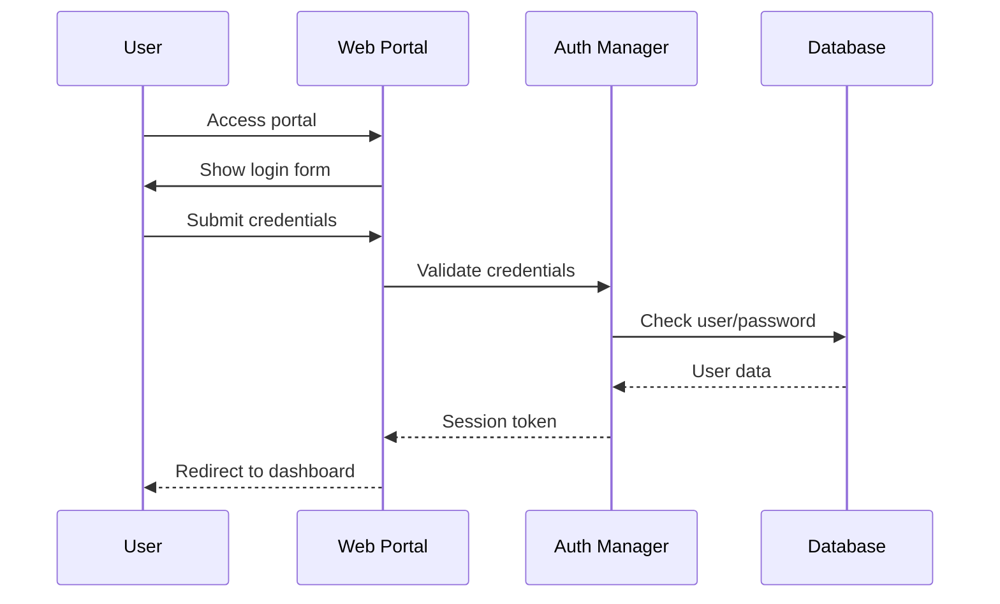
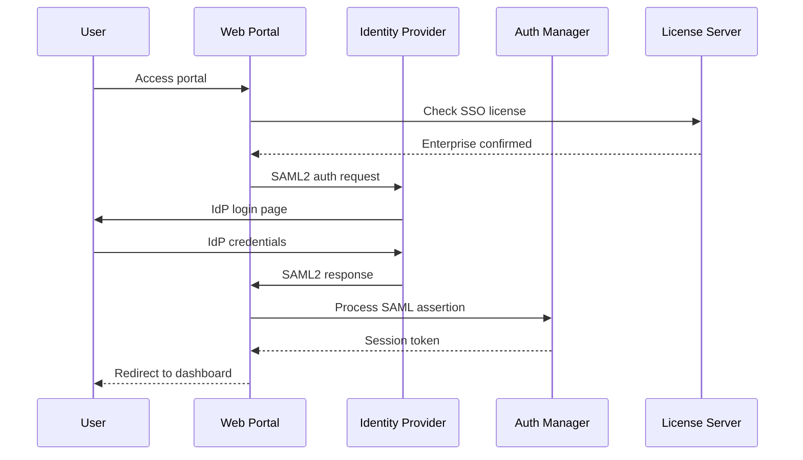

# 🔐 Authentication Guide

## 📋 Overview

SASEWaddle provides flexible authentication options that scale from simple deployments to enterprise environments. **Basic username/password authentication is always available** regardless of license tier, with enterprise features providing additional authentication methods.

## 🎯 Authentication Methods

### 🔑 Basic Authentication (All Tiers)
**Always Available** - No license restrictions

- **Username/Password**: Standard web portal authentication
- **Local User Management**: Create and manage users directly in SASEWaddle
- **Role-Based Access**: Admin and Reporter roles
- **Session Management**: Secure session handling with configurable timeouts
- **Password Security**: bcrypt hashing with secure defaults

**Configuration:**
```bash
# No special configuration required - always enabled
export SESSION_TIMEOUT_HOURS=8
export JWT_SECRET=your-secure-secret
```

### 🏢 Enterprise Authentication (Enterprise Tier)
**License Required** - Available with Enterprise license

#### SSO/SAML2 Integration
- **SAML2 Identity Providers**: Okta, Azure AD, Google Workspace, etc.
- **Single Sign-On**: Seamless integration with corporate IdP
- **Attribute Mapping**: Map IdP attributes to SASEWaddle roles
- **Session Federation**: Consistent login experience

**Configuration:**
```bash
export SSO_ENABLED=true
export SAML2_IDP_URL=https://your-idp.com/saml2
export SAML2_ENTITY_ID=sasewaddle
export SAML2_CERTIFICATE_PATH=/certs/saml.crt
export SAML2_PRIVATE_KEY_PATH=/certs/saml.key
```

#### OAuth2 Integration
- **OAuth2 Providers**: GitHub, GitLab, custom OAuth2 servers
- **Authorization Code Flow**: Standard OAuth2 implementation
- **Scope-Based Access**: Map OAuth2 scopes to SASEWaddle permissions

**Configuration:**
```bash
export OAUTH2_ENABLED=true
export OAUTH2_PROVIDER_URL=https://github.com
export OAUTH2_CLIENT_ID=your-client-id
export OAUTH2_CLIENT_SECRET=your-client-secret
export OAUTH2_REDIRECT_URI=https://manager.example.com/auth/oauth2/callback
```

#### LDAP/Active Directory
- **Directory Integration**: Connect to existing LDAP/AD infrastructure
- **Group Mapping**: Map LDAP groups to SASEWaddle roles
- **Nested Groups**: Support for complex organizational structures
- **TLS Encryption**: Secure LDAP communication

**Configuration:**
```bash
export LDAP_ENABLED=true
export LDAP_SERVER=ldap://ldap.company.com:389
export LDAP_BIND_DN=cn=sasewaddle,ou=service,dc=company,dc=com
export LDAP_BIND_PASSWORD=service-password
export LDAP_USER_BASE=ou=users,dc=company,dc=com
export LDAP_GROUP_BASE=ou=groups,dc=company,dc=com
```

#### Multi-Factor Authentication (MFA)
- **TOTP Support**: Time-based one-time passwords (Google Authenticator, Authy)
- **SMS Integration**: Text message verification
- **Hardware Tokens**: FIDO2/WebAuthn support
- **Backup Codes**: Recovery codes for lost devices

**Configuration:**
```bash
export MFA_ENABLED=true
export MFA_TOTP_ENABLED=true
export MFA_SMS_ENABLED=true
export SMS_PROVIDER=twilio
export TWILIO_ACCOUNT_SID=your-sid
export TWILIO_AUTH_TOKEN=your-token
```

## 🔄 Authentication Flow

### Basic Authentication Flow


### Enterprise SSO Flow


## 🛡️ Security Features

### Password Security
- **bcrypt Hashing**: Industry-standard password hashing
- **Salt Generation**: Unique salt per password
- **Work Factor**: Configurable bcrypt rounds (default: 12)
- **Password Policies**: Minimum length, complexity requirements

### Session Security
- **Secure Cookies**: HttpOnly, Secure, SameSite flags
- **Session Rotation**: New session ID on privilege changes
- **Timeout Handling**: Configurable session expiration
- **Concurrent Sessions**: Limit multiple sessions per user

### API Authentication
- **JWT Tokens**: Stateless API authentication
- **API Keys**: Client-specific authentication
- **Rate Limiting**: Protect against brute force attacks
- **IP Whitelisting**: Restrict access by source IP

## ⚙️ Configuration Examples

### Basic Setup (All Tiers)
```yaml
# docker-compose.yml
services:
  manager:
    environment:
      - JWT_SECRET=your-256-bit-secret
      - SESSION_TIMEOUT_HOURS=8
      - DB_HOST=mysql
      - DB_USER=sasewaddle
      - DB_PASSWORD=${DB_PASSWORD}
```

### Enterprise Setup with SSO
```yaml
# docker-compose.yml
services:
  manager:
    environment:
      # Basic configuration
      - JWT_SECRET=your-256-bit-secret
      - SESSION_TIMEOUT_HOURS=8
      
      # License
      - SASEWADDLE_LICENSE_KEY=${ENTERPRISE_LICENSE}
      
      # SSO Configuration
      - SSO_ENABLED=true
      - SAML2_IDP_URL=https://company.okta.com/app/sasewaddle/exk123/sso/saml
      - SAML2_ENTITY_ID=sasewaddle-production
      
      # LDAP Configuration  
      - LDAP_ENABLED=true
      - LDAP_SERVER=ldaps://ldap.company.com:636
      - LDAP_USER_BASE=ou=users,dc=company,dc=com
      
      # MFA Configuration
      - MFA_ENABLED=true
      - MFA_TOTP_ENABLED=true
    volumes:
      - ./certs/saml.crt:/certs/saml.crt:ro
      - ./certs/saml.key:/certs/saml.key:ro
```

## 🔍 User Management

### Creating Users (Basic Auth)
```bash
# Via API
curl -X POST https://manager.example.com/api/web/user \
  -H "Authorization: Bearer ${ADMIN_TOKEN}" \
  -H "Content-Type: application/json" \
  -d '{
    "username": "john.doe",
    "email": "john@company.com", 
    "password": "secure-password",
    "role": "reporter"
  }'
```

### Role Mapping (Enterprise)
```yaml
# LDAP Group Mapping
ldap_role_mapping:
  "CN=SASEWaddle-Admins,OU=Groups,DC=company,DC=com": "admin"
  "CN=Network-Team,OU=Groups,DC=company,DC=com": "reporter"
  "CN=IT-Staff,OU=Groups,DC=company,DC=com": "user"

# SAML2 Attribute Mapping
saml_attribute_mapping:
  role_attribute: "http://schemas.microsoft.com/ws/2008/06/identity/claims/groups"
  role_mapping:
    "sasewaddle-admins": "admin"
    "network-engineers": "reporter"
```

## 🚨 Troubleshooting

### Common Issues

#### Basic Authentication Issues
```bash
# Check user exists
curl https://manager.example.com/api/web/users \
  -H "Authorization: Bearer ${ADMIN_TOKEN}"

# Test login
curl -X POST https://manager.example.com/login \
  -d "username=admin&password=admin123"
```

#### SSO Configuration Issues
```bash
# Verify license supports SSO
curl -X POST https://license.squawkdns.com/api/sasewaddle/check_feature \
  -H "Content-Type: application/json" \
  -d '{"license_key": "YOUR-LICENSE", "feature": "sso_authentication"}'

# Check SAML2 metadata
curl https://manager.example.com/auth/saml2/metadata
```

#### LDAP Connection Issues
```bash
# Test LDAP connectivity
ldapsearch -x -H ldap://ldap.company.com \
  -D "cn=sasewaddle,ou=service,dc=company,dc=com" \
  -W -b "ou=users,dc=company,dc=com" "(uid=testuser)"
```

### Debug Logging
```bash
# Enable authentication debug logs
export LOG_LEVEL=DEBUG
export AUTH_DEBUG=true
```

## 🔒 Best Practices

### Security Recommendations
1. **Always use HTTPS** for web portal access
2. **Regular password rotation** for service accounts
3. **Monitor authentication logs** for suspicious activity
4. **Use strong JWT secrets** (256-bit minimum)
5. **Enable MFA** for admin accounts in enterprise deployments
6. **Regular security audits** of user accounts and permissions

### Deployment Considerations
1. **Start with basic auth** for initial deployment
2. **Plan SSO integration** early in enterprise rollouts
3. **Test authentication flows** in staging environment
4. **Document role mappings** for operational teams
5. **Backup authentication methods** for emergency access

## 📝 Related Documentation

- [Licensing Guide](./LICENSING.md) - Enterprise feature licensing
- [API Documentation](./API.md) - API authentication methods
- [Quickstart Guide](./QUICKSTART.md) - Basic setup instructions
- [Architecture Overview](./ARCHITECTURE.md) - Authentication in the overall system