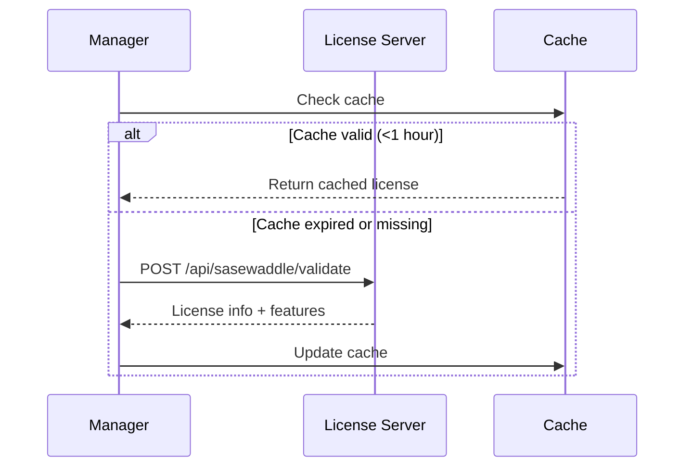

# 🔐 SASEWaddle Licensing Guide

## 📋 Overview

SASEWaddle uses a tiered licensing model to provide different feature sets based on organizational needs. The licensing system is managed through a centralized license server at **license.penguintech.io** that validates licenses and controls feature access.

> 🎁 **Multi-Product Support**: SASEWaddle licenses can be bundled with other PenguinTech products (SquawkDNS, WaddleBot) under a single license key. See [Multi-Product Licensing Guide](./MULTI_PRODUCT_LICENSING.md) for details.

## 🎯 License Tiers

### 🆓 Community Open Source Edition
Full-featured VPN solution with no artificial limits.

**Features:**
- ✅ WireGuard VPN connectivity
- ✅ Basic firewall rules
- ✅ Certificate management
- ✅ Web portal access
- ✅ Username/password authentication
- ✅ Split/Full tunnel configuration
- ✅ **Unlimited clients** 🚀
- ✅ **Unlimited headends** 🚀
- ✅ Community support (GitHub Issues)

### 💼 Professional Tier
Ideal for growing organizations with monitoring needs.

**Includes everything in Community, plus:**
- ✅ **Client metrics collection** 📊
- ✅ **Prometheus metrics export** 📈
- ✅ **Pre-built Grafana dashboards** 📉
- ✅ Advanced firewall rules
- ✅ VRF support
- ✅ OSPF routing
- ✅ **Still unlimited clients/headends** 🚀
- ✅ Email support

*Note: All authentication features remain available - no limits removed*

### 🏢 Enterprise Tier
Complete solution for large organizations with advanced security requirements.

**Includes everything in Professional, plus:**
- ✅ **SSO/SAML2/OAuth2 authentication** 🔑 *(in addition to basic auth)*
- ✅ **LDAP/Active Directory integration** 📁 *(supplements basic auth)*
- ✅ **Multi-factor authentication (MFA)** 🔐 *(optional enhancement)*
- ✅ **Traffic mirroring for IDS/IPS** 🔍
- ✅ **Centralized syslog export** 📝
- ✅ **Full API access** 🔌
- ✅ **Custom branding/white-label** 🎨
- ✅ **Priority 24/7 support** 🚨
- ✅ **Still unlimited clients/headends** 🚀

*Note: Basic username/password authentication is always available. Enterprise features enhance rather than replace basic authentication.*

## 🔑 License Key Format

License keys follow this format:
```
PENG-XXXX-XXXX-XXXX-XXXX-YYYY
```

Where:
- `PENG` - PenguinTech universal product identifier (works for all products)
- `XXXX` - Random alphanumeric segments
- `YYYY` - Checksum for validation

Example: `PENG-A1B2-C3D4-E5F6-G7H8-9IJK`

> **Legacy Format**: Older `SASE-` prefixed keys still work for SASEWaddle but new licenses use the universal `PENG-` prefix.

## ⚙️ Configuration

### Setting the License Key

Set the license key via environment variable in your Manager deployment:

```bash
# In your docker-compose.yml or Kubernetes deployment
environment:
  - SASEWADDLE_LICENSE_KEY=PENG-A1B2-C3D4-E5F6-G7H8-9IJK
  - LICENSE_SERVER_URL=https://license.penguintech.io  # Optional, this is default
```

**Note:** If no license key is provided, SASEWaddle runs in **Community Open Source** mode with full core features and no artificial limits.

### Docker Compose Example

```yaml
services:
  manager:
    image: sasewaddle/manager:latest
    environment:
      - SASEWADDLE_LICENSE_KEY=${SASEWADDLE_LICENSE_KEY}
      - DB_HOST=mysql
      - DB_USER=sasewaddle
      - DB_PASSWORD=${DB_PASSWORD}
    ports:
      - "8000:8000"
```

### Kubernetes ConfigMap Example

```yaml
apiVersion: v1
kind: ConfigMap
metadata:
  name: sasewaddle-config
data:
  SASEWADDLE_LICENSE_KEY: "SASE-A1B2-C3D4-E5F6-G7H8-9IJK"
---
apiVersion: apps/v1
kind: Deployment
metadata:
  name: sasewaddle-manager
spec:
  template:
    spec:
      containers:
      - name: manager
        envFrom:
        - configMapRef:
            name: sasewaddle-config
```

## 🔍 License Validation

The Manager service validates the license on startup and caches the result for 1 hour. License checks occur when:

1. **Service starts** - Initial validation
2. **Licensed feature accessed** - On-demand validation
3. **Hourly refresh** - Automatic revalidation

### Validation Flow



## 🚫 Feature Gating

When accessing a licensed feature without the proper license tier:

### API Response
```json
{
  "error": "Feature not licensed",
  "message": "Client metrics collection requires a Professional or Enterprise license",
  "required_feature": "client_metrics",
  "current_tier": "basic"
}
```

HTTP Status: `402 Payment Required`

### Web Portal
Users will see a notice indicating the feature requires a license upgrade:

```
⚠️ This feature requires a Professional license
Contact sales@sasewaddle.com for upgrade options
```

## 📊 Licensed Features Reference

| Feature | Community | Professional | Enterprise |
|---------|-----------|--------------|------------|
| **Core VPN** | ✅ | ✅ | ✅ |
| **Basic Authentication** | ✅ | ✅ | ✅ |
| **Basic Firewall** | ✅ | ✅ | ✅ |
| **Certificate Management** | ✅ | ✅ | ✅ |
| **Web Portal** | ✅ | ✅ | ✅ |
| **Split Tunnel** | ✅ | ✅ | ✅ |
| **Client Metrics** | ❌ | ✅ | ✅ |
| **Prometheus Export** | ❌ | ✅ | ✅ |
| **Grafana Dashboards** | ❌ | ✅ | ✅ |
| **Advanced Firewall** | ❌ | ✅ | ✅ |
| **VRF/OSPF** | ❌ | ✅ | ✅ |
| **SSO/SAML2** | ❌ | ❌ | ✅ (Additional) |
| **LDAP/AD** | ❌ | ❌ | ✅ (Additional) |
| **MFA** | ❌ | ❌ | ✅ (Optional) |
| **Traffic Mirroring** | ❌ | ❌ | ✅ |
| **Syslog Export** | ❌ | ❌ | ✅ |
| **API Access** | ✅ Full | ✅ Full | ✅ Full |
| **Custom Branding** | ❌ | ❌ | ✅ |
| **Max Clients** | **Unlimited** 🚀 | **Unlimited** 🚀 | **Unlimited** 🚀 |
| **Max Headends** | **Unlimited** 🚀 | **Unlimited** 🚀 | **Unlimited** 🚀 |
| **Support** | Community (GitHub) | Email | 24/7 Priority |

## 🛠️ Troubleshooting

### Common Issues

#### License Not Recognized
```bash
# Check if license key is set
echo $SASEWADDLE_LICENSE_KEY

# Test license validation manually
curl -X POST https://license.penguintech.io/api/sasewaddle/validate \
  -H "Content-Type: application/json" \
  -d '{"license_key": "YOUR-LICENSE-KEY"}'
```

#### Feature Not Working
```bash
# Check specific feature availability
curl -X POST https://license.penguintech.io/api/sasewaddle/check_feature \
  -H "Content-Type: application/json" \
  -d '{"license_key": "YOUR-LICENSE-KEY", "feature": "client_metrics"}'
```

#### License Server Unreachable
- The system will use cached license data for up to 24 hours
- Community features remain available if license cannot be validated
- Check network connectivity to license.penguintech.io

### License Status in Manager

Check current license status via the Manager API:

```bash
curl https://manager.example.com/api/v1/license/status \
  -H "Authorization: Bearer YOUR_TOKEN"
```

Response:
```json
{
  "valid": true,
  "tier": "professional",
  "organization": "Acme Corp",
  "expires_at": "2025-12-31T23:59:59Z",
  "features": ["client_metrics", "prometheus_export", ...],
  "max_clients": 100,
  "max_headends": 5,
  "current_clients": 45,
  "current_headends": 2
}
```

## 📧 Getting a License

### Trial License
Request a 30-day trial license:
- Email: sales@sasewaddle.com
- Include: Organization name, use case, expected scale

### Purchase Options
- **Professional**: $499/month or $4,999/year
- **Enterprise**: Custom pricing based on scale
- **Volume discounts** available
- **Educational discounts** for qualified institutions

### License Renewal
- Licenses are typically valid for 1 year
- Renewal reminders sent 30 days before expiration
- Grace period of 7 days after expiration

## 🔒 Security

- License keys are validated server-side only
- No sensitive data stored in license keys
- All license validations are logged for audit
- License server uses TLS 1.3 encryption
- Rate limiting prevents brute-force attempts

## 📝 Compliance

The licensing system helps with:
- **Asset tracking** - Know exactly what's deployed
- **Feature audit** - Track which features are in use
- **Compliance reporting** - Export license usage data
- **Budget planning** - Understand scaling needs

## 🔗 Related Documentation

- [API Documentation](./API.md)
- [Metrics & Monitoring](./METRICS_MONITORING.md)
- [Installation Guide](./QUICKSTART.md)
- [Architecture Overview](./ARCHITECTURE.md)