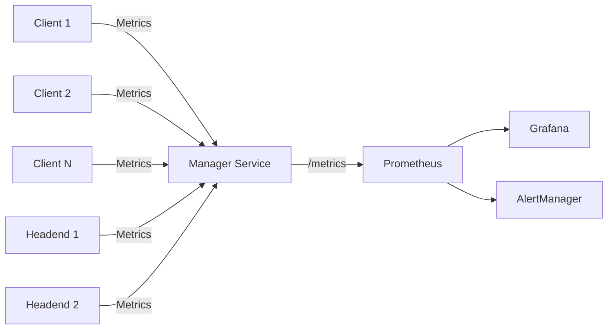

# 📊 Metrics & Monitoring Guide

## 🎯 Overview

Tobogganing provides comprehensive metrics collection and monitoring capabilities through Prometheus-compatible endpoints. Both clients and headends report metrics to the manager service, enabling real-time monitoring and alerting.

## 📈 Metrics Collection Architecture



## 🔌 API Endpoints

### Client Metrics Submission

```bash
POST /api/v1/clients/{client_id}/metrics
Authorization: Bearer {api_key}
Content-Type: application/json
```

**Request Body:**
```json
{
  "headless": false,
  "metrics": {
    "bytes_sent": 1048576,
    "bytes_received": 2097152,
    "packets_sent": 1000,
    "packets_received": 1500,
    "connection_uptime": 3600
  }
}
```

### Headend Metrics Submission

```bash
POST /api/v1/headends/{headend_id}/metrics
Authorization: Bearer {jwt_token}
Content-Type: application/json
```

**Request Body:**
```json
{
  "headend_name": "headend-us-east-1",
  "metrics": {
    "active_connections": 150,
    "bandwidth_in": 10485760,
    "bandwidth_out": 5242880,
    "cpu_usage": 45.2,
    "memory_usage": 2147483648
  }
}
```

## 📊 Available Metrics

### Client Metrics

| Metric | Type | Description | Labels |
|--------|------|-------------|--------|
| `tobogganing_client_bytes_sent` | Gauge | Bytes sent by client | client_id, name, type, headless |
| `tobogganing_client_bytes_received` | Gauge | Bytes received by client | client_id, name, type, headless |
| `tobogganing_client_packets_sent` | Gauge | Packets sent by client | client_id, name, type, headless |
| `tobogganing_client_packets_received` | Gauge | Packets received by client | client_id, name, type, headless |
| `tobogganing_client_connection_uptime_seconds` | Gauge | Connection uptime | client_id, name, type, headless |
| `tobogganing_client_last_check_in_timestamp` | Gauge | Last check-in time | client_id, name, type, headless |

### Headend Metrics

| Metric | Type | Description | Labels |
|--------|------|-------------|--------|
| `tobogganing_headend_active_connections` | Gauge | Active connections | headend_id, name, region, datacenter |
| `tobogganing_headend_bandwidth_in_bytes` | Gauge | Incoming bandwidth | headend_id, name, region, datacenter |
| `tobogganing_headend_bandwidth_out_bytes` | Gauge | Outgoing bandwidth | headend_id, name, region, datacenter |
| `tobogganing_headend_cpu_usage_percent` | Gauge | CPU usage percentage | headend_id, name, region, datacenter |
| `tobogganing_headend_memory_usage_bytes` | Gauge | Memory usage | headend_id, name, region, datacenter |
| `tobogganing_headend_last_check_in_timestamp` | Gauge | Last check-in time | headend_id, name, region, datacenter |

### Manager Service Metrics

| Metric | Type | Description |
|--------|------|-------------|
| `tobogganing_manager_clusters_total` | Gauge | Total registered clusters |
| `tobogganing_manager_clients_total` | Gauge | Total registered clients |
| `tobogganing_manager_http_requests_total` | Counter | HTTP requests processed |
| `tobogganing_manager_auth_attempts_total` | Counter | Authentication attempts |
| `tobogganing_manager_certificates_issued_total` | Counter | Certificates issued |

## 🔐 Authentication

### Prometheus Scraping

The `/metrics` endpoint requires authentication via Bearer token:

```yaml
# prometheus.yml
scrape_configs:
  - job_name: 'tobogganing-manager'
    bearer_token: 'YOUR_METRICS_TOKEN'
    static_configs:
      - targets: ['manager.example.com:8000']
```

Set the metrics token via environment variable:
```bash
export METRICS_TOKEN=your-secure-token-here
```

## 📱 Client Integration

### Go Native Client Example

```go
package main

import (
    "bytes"
    "encoding/json"
    "net/http"
    "time"
)

type ClientMetrics struct {
    Headless bool                 `json:"headless"`
    Metrics  map[string]interface{} `json:"metrics"`
}

func submitMetrics(clientID, apiKey string) error {
    metrics := ClientMetrics{
        Headless: false,
        Metrics: map[string]interface{}{
            "bytes_sent":        getTotalBytesSent(),
            "bytes_received":    getTotalBytesReceived(),
            "packets_sent":      getTotalPacketsSent(),
            "packets_received":  getTotalPacketsReceived(),
            "connection_uptime": getConnectionUptime(),
        },
    }
    
    body, _ := json.Marshal(metrics)
    
    req, err := http.NewRequest("POST", 
        fmt.Sprintf("https://manager.example.com/api/v1/clients/%s/metrics", clientID),
        bytes.NewBuffer(body))
    
    req.Header.Set("Authorization", "Bearer " + apiKey)
    req.Header.Set("Content-Type", "application/json")
    
    client := &http.Client{Timeout: 10 * time.Second}
    resp, err := client.Do(req)
    // Handle response...
}
```

### Docker Client Example

```dockerfile
# In your Docker client
FROM alpine:latest

# Install monitoring tools
RUN apk add --no-cache curl jq

# Metrics submission script
COPY submit_metrics.sh /usr/local/bin/
RUN chmod +x /usr/local/bin/submit_metrics.sh

# Run metrics submission every minute
RUN echo "* * * * * /usr/local/bin/submit_metrics.sh" >> /etc/crontabs/root
```

```bash
#!/bin/sh
# submit_metrics.sh

CLIENT_ID="${CLIENT_ID}"
API_KEY="${API_KEY}"
MANAGER_URL="${MANAGER_URL}"

# Collect metrics
BYTES_SENT=$(cat /sys/class/net/wg0/statistics/tx_bytes)
BYTES_RECEIVED=$(cat /sys/class/net/wg0/statistics/rx_bytes)
PACKETS_SENT=$(cat /sys/class/net/wg0/statistics/tx_packets)
PACKETS_RECEIVED=$(cat /sys/class/net/wg0/statistics/rx_packets)
UPTIME=$(cat /proc/uptime | cut -d' ' -f1)

# Submit to manager
curl -X POST "${MANAGER_URL}/api/v1/clients/${CLIENT_ID}/metrics" \
  -H "Authorization: Bearer ${API_KEY}" \
  -H "Content-Type: application/json" \
  -d "{
    \"headless\": true,
    \"metrics\": {
      \"bytes_sent\": ${BYTES_SENT},
      \"bytes_received\": ${BYTES_RECEIVED},
      \"packets_sent\": ${PACKETS_SENT},
      \"packets_received\": ${PACKETS_RECEIVED},
      \"connection_uptime\": ${UPTIME}
    }
  }"
```

## 📊 Grafana Dashboard

### Example Dashboard JSON

```json
{
  "dashboard": {
    "title": "Tobogganing Monitoring",
    "panels": [
      {
        "title": "Active Clients by Type",
        "targets": [
          {
            "expr": "count by (type) (tobogganing_client_last_check_in_timestamp > (time() - 300))"
          }
        ]
      },
      {
        "title": "Total Bandwidth Usage",
        "targets": [
          {
            "expr": "sum(rate(tobogganing_client_bytes_sent[5m])) + sum(rate(tobogganing_client_bytes_received[5m]))"
          }
        ]
      },
      {
        "title": "Headend CPU Usage",
        "targets": [
          {
            "expr": "tobogganing_headend_cpu_usage_percent"
          }
        ]
      }
    ]
  }
}
```

## 🚨 Alerting Rules

### Prometheus Alert Examples

```yaml
groups:
  - name: tobogganing_alerts
    rules:
      - alert: ClientOffline
        expr: time() - tobogganing_client_last_check_in_timestamp > 900
        for: 5m
        labels:
          severity: warning
        annotations:
          summary: "Client {{ $labels.client_name }} is offline"
          description: "Client has not checked in for more than 15 minutes"
      
      - alert: HeadendHighCPU
        expr: tobogganing_headend_cpu_usage_percent > 80
        for: 10m
        labels:
          severity: critical
        annotations:
          summary: "Headend {{ $labels.headend_name }} high CPU usage"
          description: "CPU usage is {{ $value }}%"
      
      - alert: HeadendDown
        expr: time() - tobogganing_headend_last_check_in_timestamp > 300
        for: 2m
        labels:
          severity: critical
        annotations:
          summary: "Headend {{ $labels.headend_name }} is down"
          description: "Headend has not reported metrics for 5 minutes"
```

## 🔍 Debugging

### Check Metrics Endpoint

```bash
# Get raw metrics (requires authentication)
curl -H "Authorization: Bearer YOUR_METRICS_TOKEN" \
     https://manager.example.com/metrics

# Check specific metric
curl -H "Authorization: Bearer YOUR_METRICS_TOKEN" \
     https://manager.example.com/metrics | grep tobogganing_client_bytes_sent
```

### Verify Client Submission

```bash
# Test client metrics submission
curl -X POST https://manager.example.com/api/v1/clients/test-client/metrics \
  -H "Authorization: Bearer YOUR_API_KEY" \
  -H "Content-Type: application/json" \
  -d '{
    "headless": false,
    "metrics": {
      "bytes_sent": 1000,
      "bytes_received": 2000,
      "connection_uptime": 60
    }
  }' -v
```

## 📋 Best Practices

1. **Submission Frequency**
   - Clients: Every 1-5 minutes
   - Headends: Every 30-60 seconds
   - Adjust based on network conditions

2. **Metric Retention**
   - Keep high-resolution data for 24 hours
   - Downsample to 5-minute averages for 7 days
   - Monthly aggregates for long-term storage

3. **Security**
   - Use unique API keys per client
   - Rotate metrics tokens regularly
   - Monitor for anomalous submission patterns

4. **Performance**
   - Batch metrics when possible
   - Use compression for large payloads
   - Implement exponential backoff on failures

## 🔗 Related Documentation

- [API Documentation](./API.md)
- [System Check-in Dashboard](./CHECKIN_DASHBOARD.md)
- [Architecture Overview](./ARCHITECTURE.md)
- [Prometheus Documentation](https://prometheus.io/docs/)