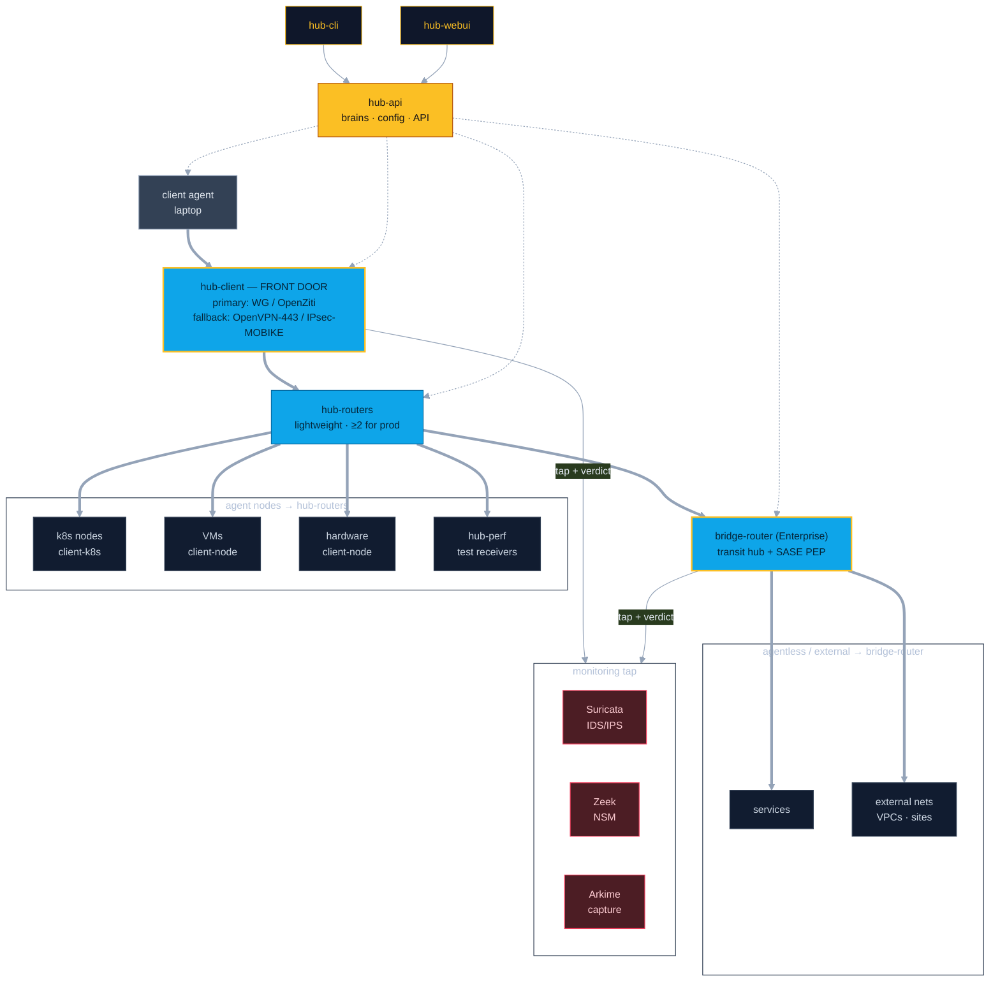

# Tobogganing — network topology

Data path: **client agent (laptop) → hub-client (front door) → hub-routers → resources**; agentless / external targets via **bridge-router** (Enterprise).
Control plane: **hub-api** is the brain; **hub-cli** and **hub-webui** are thin overlays. Every client, hub, and bridge pulls its configuration from hub-api over **gRPC**. The two **Inspection Points** (hub-client, bridge-router) tap Suricata / Zeek / Arkime for alerts + block verdicts.

**Legend** — thick = data path (traffic) · dotted = config via gRPC (also to every node agent & hub-perf) · thin = sensor tap + block verdict · amber-bordered node = Inspection Point.

## How to read it

- **Front door (hub-client):** end-user access lands here — primary WireGuard/OpenZiti, auto-falling back to OpenVPN-over-443 or IPsec/MOBIKE on restrictive networks. Also terminates contractors, vendor/customer S2S IPsec, and (future) Apache Guacamole clientless. Everything is inspected before the fabric.
- **Fabric (hub-routers):** lightweight c2c transport + node relay — basic policy + auth only. ≥2 for production (warn on 1). Agent nodes (client-k8s / client-node) connect here directly.
- **Bridge (bridge-router, Enterprise):** transit/interconnect hub (GCP NCC / AWS TGW-style) + SASE PEP for agentless services and external nets / VPCs / sites.
- **Inspection Points (hub-client + bridge-router):** customized proxy (Envoy+Rust filters *or* custom Rust/Go — TBD) that taps Suricata (IDS/IPS), Zeek (NSM), and Arkime (capture), which return alerts + inline block verdicts.
- **Control plane:** hub-cli + hub-webui are thin overlays on hub-api; every client/hub/bridge pulls config from hub-api via gRPC (single source of truth).
- **Out of scope:** intra-cluster k8s east-west security (Cilium NetworkPolicy / admission / Tetragon) — owned by the Gough project. Tobogganing owns the true network/overlay layer.

See `docs/superpowers/specs/2026-07-22-hub-topology-quart-brain-design.md` for the full target architecture, enrollment/connect-token model, and phasing.
