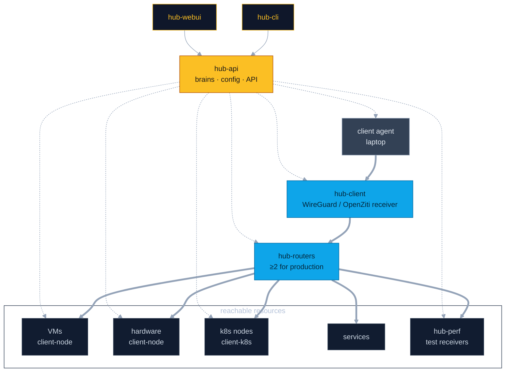

# Tobogganing — network topology

Data path: **client agent (laptop) → hub-client → hub-routers → resources**.
Control plane: **hub-api** is the brain (config + API); **hub-cli** and **hub-webui** are thin user overlays on top of it. Every client, hub, and bridge pulls its configuration from hub-api over **gRPC**.

**Legend** — solid thick = data path (traffic); dotted = configuration via gRPC.

## How to read it

- **Data plane:** the laptop client agent connects into **hub-client** (WireGuard/OpenZiti receiver for end-user clients), which hands off to the **hub-routers**; from there it reaches VMs, hardware, k8s nodes, and services.
- **Control plane:** **hub-cli** and **hub-webui** are thin overlays on **hub-api** for configuration, management, and review — no business logic of their own. hub-webui is today's React portal; hub-cli is new.
- **Config over gRPC:** every client, hub, and bridge fetches its configuration from hub-api via gRPC — hub-api is the single source of truth.
- **Redundancy:** production requires **≥2 hub-routers**; a single hub-router is flagged "not production ready."
- **Per-user transport:** WireGuard vs OpenZiti is chosen per end-user in hub-api and delivered to the penguin agent as a config file.

See `docs/superpowers/specs/2026-07-22-hub-topology-quart-brain-design.md` for the full target architecture and phasing.
