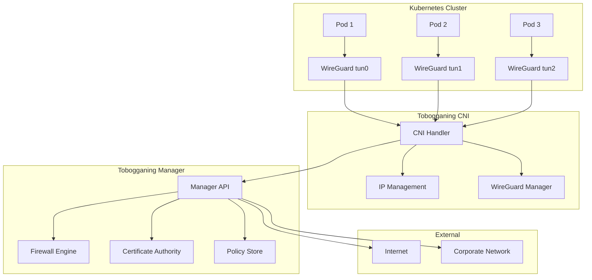

# 🚀 Tobogganing Kubernetes CNI Plugin

A high-performance Container Network Interface (CNI) plugin that integrates Kubernetes pods with the Tobogganing Secure Access Service Edge (SASE) platform. This CNI provides Zero Trust networking with WireGuard tunnels, centralized policy management, and minimal performance overhead.

## 🌟 Features

### Core Networking
- **🔐 WireGuard Integration**: Per-pod WireGuard tunnels for secure networking
- **⚡ High Performance**: Optimized for minimal overhead and fast pod startup
- **🌐 Dual Stack**: Full IPv4 and IPv6 support
- **🔄 Dynamic IPAM**: Intelligent IP address management with local and centralized allocation

### Zero Trust Security
- **🛡️ Policy Integration**: Seamless integration with Tobogganing firewall policies
- **🔑 Certificate Management**: Automatic key generation and rotation
- **📊 Audit Logging**: Comprehensive security audit trails
- **🚫 Default Deny**: Zero Trust networking with explicit allow policies

### Enterprise Features
- **📈 Scalability**: Supports thousands of pods per node
- **🔍 Observability**: Prometheus metrics and structured logging
- **🏢 Multi-Cluster**: Cross-cluster networking and policy management
- **☁️ Cloud Native**: Kubernetes-native with CRD support

### Performance Optimizations
- **⚡ Fast Path**: Optimized packet processing
- **🔄 Connection Pooling**: Efficient resource management
- **📊 Buffer Tuning**: Configurable network buffers
- **🚀 Startup Speed**: Sub-second pod network setup

## 🏗️ Architecture



## 📋 Requirements

### System Requirements
- **Kubernetes**: 1.24+ (CNI spec 1.0.0)
- **Linux Kernel**: 5.6+ (WireGuard support)
- **Architecture**: AMD64, ARM64
- **Memory**: 128MB per node minimum
- **CPU**: 100m per node minimum

### Dependencies
- **WireGuard**: Kernel module or userspace implementation
- **iptables**: For firewall rules
- **iproute2**: For network interface management
- **Tobogganing Manager**: v1.1.0+

### Privileges
- **Network Admin**: Required for interface creation
- **System Admin**: Required for namespace operations
- **Privileged**: Runs as privileged DaemonSet

## 🚀 Quick Start

### 1. Install Tobogganing Manager

First, ensure you have a Tobogganing Manager running:

```bash
# Deploy Tobogganing Manager
kubectl apply -f https://github.com/tobogganing/manager/releases/latest/download/manager.yaml
```

### 2. Configure API Access

Create API credentials:

```bash
# Generate API key from manager
TOBOGGANING_API_KEY=$(kubectl exec -n tobogganing-system deployment/manager -- \
  python3 -c "from manager.api import generate_api_key; print(generate_api_key('k8s-cni'))")

# Create secret
kubectl create secret generic tobogganing-cni-secrets \
  --namespace=kube-system \
  --from-literal=api-key="$TOBOGGANING_API_KEY"
```

### 3. Deploy CNI Plugin

```bash
# Update configuration
kubectl apply -f - <<EOF
apiVersion: v1
kind: ConfigMap
metadata:
  name: tobogganing-cni-config
  namespace: kube-system
data:
  manager-url: "https://your-tobogganing-manager.example.com"
  cluster-id: "your-cluster-name"
EOF

# Deploy CNI DaemonSet
kubectl apply -f deploy/daemonset.yaml
kubectl apply -f deploy/network-policy.yaml
```

### 4. Verify Installation

```bash
# Check CNI pods
kubectl get pods -n kube-system -l app=tobogganing-cni

# Check CNI binary installation
kubectl exec -n kube-system daemonset/tobogganing-cni -- \
  ls -la /host/opt/cni/bin/tobogganing

# Test with a sample pod
kubectl run test-pod --image=nginx --rm -it -- /bin/bash
```

## ⚙️ Configuration

### Basic Configuration

Create `/etc/cni/net.d/10-tobogganing.conflist`:

```json
{
  \"cniVersion\": \"1.0.0\",
  \"name\": \"tobogganing\",
  \"plugins\": [{
    \"type\": \"tobogganing\",
    \"tobogganing\": {
      \"managerURL\": \"https://manager.example.com\",
      \"apiKey\": \"${TOBOGGANING_API_KEY}\",
      \"clusterID\": \"production-cluster\",
      \"wireguard\": {
        \"interfacePrefix\": \"tob\",
        \"mtu\": 1420
      }
    },
    \"ipam\": {
      \"type\": \"tobogganing-ipam\",
      \"subnet\": \"10.200.0.0/16\",
      \"gateway\": \"10.200.0.1\"
    }
  }]
}
```

### Advanced Configuration Options

<details>
<summary>Click to expand advanced configuration</summary>

```json
{
  \"cniVersion\": \"1.0.0\",
  \"name\": \"tobogganing\",
  \"plugins\": [{
    \"type\": \"tobogganing\",
    \"tobogganing\": {
      \"managerURL\": \"https://manager.example.com\",
      \"apiKey\": \"${TOBOGGANING_API_KEY}\",
      \"clusterID\": \"production-cluster\",
      
      \"wireguard\": {
        \"interfacePrefix\": \"tob\",
        \"keyPath\": \"/etc/cni/net.d/tobogganing/keys\",
        \"mtu\": 1420,
        \"listenPort\": 0,
        \"persistentKeepalive\": 25,
        \"allowedIPs\": [\"0.0.0.0/0\"]
      },
      
      \"performance\": {
        \"receiveBufferSize\": 2097152,
        \"sendBufferSize\": 2097152,
        \"workerCount\": 4,
        \"setupTimeout\": \"30s\",
        \"healthCheckTimeout\": \"10s\",
        \"enableFastPath\": true,
        \"enableOffload\": false
      },
      
      \"security\": {
        \"forceEncryption\": true,
        \"defaultDeny\": false,
        \"enableAuditLog\": true,
        \"auditLogPath\": \"/var/log/tobogganing-cni/audit.log\"
      },
      
      \"logging\": {
        \"level\": \"info\",
        \"format\": \"json\",
        \"output\": \"/var/log/tobogganing-cni/cni.log\",
        \"maxSize\": 100,
        \"maxBackups\": 3,
        \"maxAge\": 28
      }
    },
    
    \"ipam\": {
      \"type\": \"tobogganing-ipam\",
      \"subnet\": \"10.200.0.0/16\",
      \"gateway\": \"10.200.0.1\",
      \"routes\": [{
        \"dst\": \"0.0.0.0/0\",
        \"gw\": \"10.200.0.1\"
      }],
      \"pool\": \"pod-network\",
      \"blockSize\": 26,
      \"autodetect\": true
    },
    
    \"dns\": {
      \"nameservers\": [\"10.200.0.1\", \"8.8.8.8\"],
      \"domain\": \"cluster.local\",
      \"search\": [
        \"default.svc.cluster.local\",
        \"svc.cluster.local\",
        \"cluster.local\"
      ]
    }
  }]
}
```

</details>

## 🏢 Production Deployment

### Kubernetes Deployment

1. **Prepare Configuration**:
   ```bash
   # Create namespace and RBAC
   kubectl apply -f - <<EOF
   apiVersion: v1
   kind: Namespace
   metadata:
     name: tobogganing-system
   ---
   apiVersion: v1
   kind: ServiceAccount
   metadata:
     name: tobogganing-cni
     namespace: kube-system
   EOF
   ```

2. **Configure Resources**:
   ```yaml
   resources:
     requests:
       cpu: 100m
       memory: 128Mi
     limits:
       cpu: 500m
       memory: 512Mi
   ```

3. **Enable Monitoring**:
   ```bash
   # Add Prometheus monitoring
   kubectl label nodes --all tobogganing.io/monitor=true
   ```

### Multi-Cluster Setup

For multi-cluster deployments:

1. **Shared Manager**: Use a single Tobogganing Manager for all clusters
2. **Unique Cluster IDs**: Each cluster needs a unique `clusterID`
3. **Network Segmentation**: Use different IP ranges per cluster
4. **Cross-Cluster Policies**: Configure firewall rules for inter-cluster communication

### Security Hardening

```yaml
securityContext:
  privileged: true  # Required for network operations
  capabilities:
    add:
    - NET_ADMIN
    - SYS_ADMIN
    drop:
    - ALL
  readOnlyRootFilesystem: true
  runAsNonRoot: false  # Must run as root for network operations
  allowPrivilegeEscalation: true
```

## 🔧 Troubleshooting

### Common Issues

1. **Pod Network Not Working**
   ```bash
   # Check CNI logs
   kubectl logs -n kube-system -l app=tobogganing-cni
   
   # Verify WireGuard interfaces
   kubectl exec -n kube-system daemonset/tobogganing-cni -- \
     ip link show type wireguard
   
   # Check CNI binary
   ls -la /opt/cni/bin/tobogganing
   ```

2. **IP Allocation Failures**
   ```bash
   # Check IPAM logs
   kubectl logs -n kube-system -l app=tobogganing-cni | grep IPAM
   
   # Verify manager connectivity
   kubectl exec -n kube-system daemonset/tobogganing-cni -- \
     curl -k https://your-manager-url/health
   ```

3. **WireGuard Interface Issues**
   ```bash
   # Check kernel module
   lsmod | grep wireguard
   
   # Verify interface creation
   ip link show type wireguard
   
   # Check keys
   ls -la /etc/cni/net.d/tobogganing/keys/
   ```

### Debug Mode

Enable debug logging:

```bash
kubectl set env daemonset/tobogganing-cni -n kube-system \
  TOBOGGANING_CNI_LOG_LEVEL=debug \
  TOBOGGANING_CNI_DEBUG=true
```

### Performance Tuning

1. **Buffer Sizes**:
   ```json
   \"performance\": {
     \"receiveBufferSize\": 4194304,
     \"sendBufferSize\": 4194304
   }
   ```

2. **Worker Threads**:
   ```json
   \"performance\": {
     \"workerCount\": 8  // Adjust based on CPU cores
   }
   ```

3. **Fast Path**:
   ```json
   \"performance\": {
     \"enableFastPath\": true,
     \"enableOffload\": true
   }
   ```

## 📊 Monitoring and Observability

### Prometheus Metrics

The CNI plugin exposes metrics on port 9090:

- `tobogganing_cni_pods_total`: Total pods managed
- `tobogganing_cni_setup_duration_seconds`: Pod setup time
- `tobogganing_cni_errors_total`: Error count by type
- `tobogganing_cni_wireguard_peers`: Active WireGuard peers

### Grafana Dashboard

Import the provided Grafana dashboard:

```bash
kubectl apply -f deploy/grafana-dashboard.yaml
```

### Structured Logging

Logs are output in JSON format for easy parsing:

```json
{
  \"timestamp\": \"2024-01-15T10:30:00Z\",
  \"level\": \"info\",
  \"component\": \"cni-handler\",
  \"containerID\": \"abc123\",
  \"podIP\": \"10.200.1.5\",
  \"message\": \"Pod network setup completed\"
}
```

## 🛠️ Development

### Building from Source

```bash
# Clone repository
git clone https://github.com/tobogganing/k8s-cni
cd k8s-cni

# Build binary
make build

# Run tests
make test

# Build Docker image
make docker-build
```

### Running Tests

```bash
# Unit tests
make test

# Integration tests (requires Kubernetes)
make test-integration

# Performance tests
make benchmark

# Coverage report
make test-coverage
```

### Contributing

1. Fork the repository
2. Create a feature branch
3. Make changes with tests
4. Run `make check` to validate
5. Submit a pull request

## 📖 Documentation

- **API Reference**: [pkg.go.dev](https://pkg.go.dev/github.com/tobogganing/k8s-cni)
- **Architecture Guide**: [docs/architecture.md](docs/architecture.md)
- **Performance Guide**: [docs/performance.md](docs/performance.md)
- **Security Guide**: [docs/security.md](docs/security.md)

## 🆘 Support

- **GitHub Issues**: [Report bugs and feature requests](https://github.com/tobogganing/k8s-cni/issues)
- **Discussions**: [Community discussions](https://github.com/tobogganing/k8s-cni/discussions)
- **Documentation**: [Full documentation](https://docs.tobogganing.io/cni)
- **Slack**: [Join our community](https://slack.tobogganing.io)

## 📄 License

This project is licensed under the MIT License - see the [LICENSE](LICENSE) file for details.

## 🙏 Acknowledgments

- **CNI Project**: For the excellent networking specification
- **WireGuard**: For the secure and fast VPN technology
- **Kubernetes Community**: For the container orchestration platform
- **Go Community**: For the excellent programming language and ecosystem

---

<p align=\"center\">
  <strong>Built with ❤️ by the Tobogganing Team</strong><br>
  <a href=\"https://tobogganing.io\">Website</a> •
  <a href=\"https://docs.tobogganing.io\">Docs</a> •
  <a href=\"https://github.com/tobogganing\">GitHub</a>
</p>